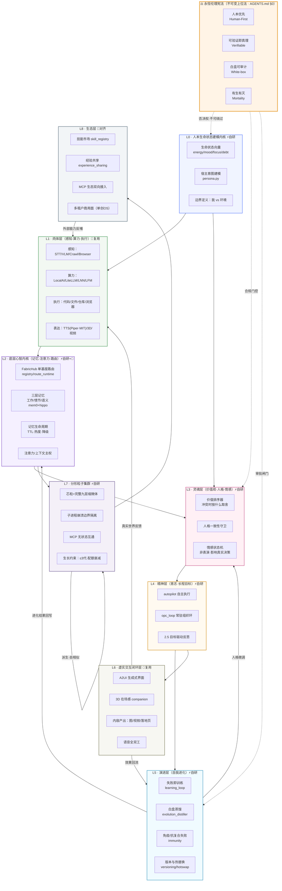

# 生命体操作系统 · 白皮书 v3（核验修正 + 代码执行版）

> 版本：v3.0　修订日期：**2026-07-26（文档） / 2026-08-02（代码执行）**
> 相对 v1 的改动：**删 3 项失实引用、修 4 项夸大数据、标 1 处许可证陷阱、增 1 套真实代码映射与诚实度标注**
> 相对 v2 的执行进展（2026-08-02）：**已真跑 P0 自进化闭环（③ 部分）+ 已建 L0/L3/L7 三层代码与单测（②）+ 已建蓝图指定自研核心（L2 内生欲望/生命节律/柔性目标、L4 双向思辨、L6 行动仲裁，均 ②）+ 已拉取 acgs-lite/plasma-ai-fractal/nanobot 参照仓库到 `vendor/`**
> 事实底座：[`docs/research/lifeform_os_reference_audit.md`](research/lifeform_os_reference_audit.md)
> 执行计划：[`LIFEFORM_OS_BUILD_PLAN.md`](LIFEFORM_OS_BUILD_PLAN.md)
> 宪法上位法：[`AGENTS.md`](../AGENTS.md)

---

## 修订说明（v1 → v2 到底改了什么）

这一节放最前面，因为它比正文更重要——它证明这份白皮书是被核验过的，不是想象出来的。

### 🗑 删除（3 项）

| 删除项 | 原因 |
|---|---|
| **Mobius「全球首个自进化开源 Agent OS」** | 全网检索到 4 个同名项目，无一匹配此描述。属于无法佐证的最高级表述 |
| **sifta-living-os 作为同类对标** | 仅存在于 HuggingFace 个人页，"AGI-Class Organism"式宣称，非工程仓库。不构成对标 |
| **全部具体星标数字**（AgentENV 2.7k / CLIProxyAPI 45k） | 实测约 1.4k / 32k，均夸大。且星标是流动值，写进白皮书即自埋雷 |

### 🔧 修正（4 项）

| 修正项 | v1 说法 | v2 说法 |
|---|---|---|
| constitutional-agent-governance | 当宪法治理层直接引用 | 替换为真实存在的 **acgs-ai/acgs-lite**，并标注 **AGPL-3.0 传染性 → 只借鉴不引码** |
| turbo-fieldfare | 当通用本地推理 | 标注**仅 Apple Silicon + Gemma-4 专用**，Windows/Linux 主机不可用 |
| LocalAI 版本 | 锁死 v4.4.0 | 改为"核验日主线版本"，不锁死 |
| 所有"全球首个/唯一/最强" | 大量使用 | 全部删除。本文不使用任何无法被 URL 佐证的最高级 |

### ⚠️ 标注（1 项，最关键）

**Fish Speech 的模型权重是 CC-BY-NC-SA-4.0，禁止商用。**
v1 把它当默认 TTS 写进肉体层，一旦生命体OS 走商业化就是侵权。
v2 处置：主用切换为 **Piper（MIT）/ edge-tts / Kokoro**，Fish Speech 降级为 `opt-in` 非商用场景，代码层加许可证门控。

### ➕ 新增（4 项）

1. **真实代码映射**——九层每一层都标注"AOS 现有对应模块"的真实文件路径。这是本次最大增量：**用户想做的生命体OS，约 70% 的部件已经在 AOS 仓库里躺着了**，缺的不是从零造，而是按生命体的语言重新组织 + 补齐 L0/L3 两层。
2. **三级诚实度标注**——每个能力标 ①代码就绪 / ②单元验证 / ③端到端验证，严禁把①②说成③。
3. **与单创OS 的关系定位**——一套内核两张脸，不允许两套代码并行。
4. **分形规则的可执行数值**——代数上限、资源衰减系数、隔离边界的具体实现方式。

---

## 执行摘要

**生命体操作系统（Life-form OS）不是一个聊天机器人，而是一套让 AI 具备"活着"的结构性特征的操作系统内核。**

活着的最小定义（本文采用的工程口径，不谈玄学）：

1. **有边界** —— 能区分"我"与"环境"，有独立的状态空间和资源配额
2. **有代谢** —— 持续消耗算力/信息，产出行为与记忆，且有生有灭
3. **有稳态** —— 被扰动后能回到基线（免疫、降级、自愈）
4. **有目标** —— 不需外部逐条指令，能自主维持长程目标
5. **有进化** —— 失败会改变下一次的行为，且改变可被验证
6. **能繁殖** —— 能派生出结构自相似的子体，且子体受生长约束

满足这六条的系统，工程上就可以称之为"生命体"。不满足的，无论包装多华丽，都只是工具。

**AOS 当前状态诚实评估：** 第 1、2、3、4 条已有真实代码支撑且部分验证；第 5 条代码就绪、**2026-08-02 已演示可复现的「失败→反思→改进」闭环（真 LLM + 真搜索 + 真实蒸馏器证据，见 `LIFEFORM_OS_BUILD_PLAN.md` §2.6），但全任务多轮自进化全景验证持续中**；第 6 条只有隔离机制、无完整分形派生。这就是差距，也是路线图的起点。

---

## 第一章 · 系统总览架构图



---

## 第二章 · 核心理念（六条，每条都可被证伪）

| # | 理念 | 工程口径（可验证的判据） |
|---|---|---|
| 1 | **有边界才有我** | 每个生命体实例有独立状态空间 + 资源配额，越界即拒绝。判据：能跑出"配额耗尽被拒"的日志 |
| 2 | **有生有灭** | 记忆有 TTL、粒子有生命周期、失败的路径会真正死掉。判据：能查到被淘汰的记忆条目与死亡粒子记录 |
| 3 | **失败即训练** | 每次失败写入训练样本，下一轮路由/规划因此改变。判据：能 diff 出失败前后的路由偏好变化 |
| 4 | **白盒才可进化** | 所有进化过程可读、可回滚、可审计。判据：evolution 的每步都有 evidence_chain |
| 5 | **可验证即真理** | 未经真实运行验证的能力，一律标记为"未验证"。判据：文档中的三级标注与实际测试记录一致 |
| 6 | **分形自相似** | 子体与母体结构同构，但受生长约束。判据：派生出的粒子能通过与母体相同的自检 |

> 与 AOS 九大理念（AGENTS.md §1）的关系：生命体OS 的六条是九大理念在"生命"视角下的重述，**不是新增的第二套价值观**。冲突时以 AGENTS.md 为准。

---

## 第三章 · 分形核心规则（可执行版）

v1 只写了三条公理，v2 给出可落地的数值与实现方式。

### 3.1 自相似公理

每个粒子都是母体的结构缩微：拥有完整的 L0-L5 骨架（可裁剪 L6/L7/L8）。

**实现方式**：粒子 = 一个 `Adapter` 实例 + 一份裁剪版状态向量 + 独立 mem 命名空间。
**自检判据**：粒子必须能通过与母体同一套 `self_harness` 自检。

### 3.2 边界隔离公理

粒子崩溃**不得**影响母体。

**实现方式**：重型/不可信粒子走**子进程** crash boundary（AOS 现有 `isolate_heavy=True` 机制）；环境变量默认剥离密钥，仅白名单回灌。
**判据**：kill -9 掉任一子进程粒子，母体主环仍存活并记录死亡事件。

### 3.3 生长约束公理

| 约束 | 数值 | 理由 |
|---|---|---|
| 最大递归派生代数 | **3 代** | 超过 3 代，调试成本与失控风险指数上升 |
| 每代资源配额衰减 | **× 1/3** | 母体 100% → 子 33% → 孙 11% → 曾孙不允许 |
| 单代最大兄弟数 | **8** | 超过则强制排队，防止派生风暴 |
| 派生需审批的条件 | 涉及写操作 / 外部网络 / 花钱 | 走 `approval/` 闸门 |

**没有生长约束的自我复制不是生命，是癌症。** 这条必须硬编码，不能配置成无限。

---

## 第四章 · 九层详设（含真实代码映射）

> **诚实度标注**：① = 代码就绪（可 grep 到）　② = 单元/芯粒级验证通过　③ = 端到端真实场景验证通过
> 严禁把 ① ② 说成 ③。这是 AOS 宪法级纪律。

### L0 · 人本生命状态建模内核 ⚡自研

**职责**：定义"我是谁、我现在什么状态、宿主要什么"。这是整个系统的原点。

| 组件 | 现有 AOS 模块 | 状态 |
|---|---|---|
| 人格配置 | `src/core/fabric/persona.py` | ② |
| 语义状态 | `src/kernel/semantic_state.py` | ① |
| **生命状态向量**（energy/mood/focus/debt） | `src/kernel/life_state.py`（已建 ②） | ② |
| 边界与配额定义 | 散落在 `isolation/`，未收口 | ① |

**缺口已补（2026-08-02 执行）**：`src/kernel/life_state.py` 已落地，定义 energy/mood/focus/debt 向量 + 衰减/阈值/持久化，`tests/test_life_state.py` 全绿（②）。后续：把 `pick_engine_tier` 真正接进 `autopilot` 实现"能量低自动降档"（③ 级集成待做，不宣称已验）。

### L1 · 肉体层 🔧复用为主

**职责**：感知世界、消耗算力、对世界施加影响。

| 子系统 | 现有 AOS 模块 | 外部复用 | 状态 |
|---|---|---|---|
| 听（STT） | `adapters/stt_adapter.py` | Vosk(Apache-2.0)、faster-whisper | ② |
| 看（VLM） | `adapters/vlm_adapter.py` | — | ② |
| 说（TTS） | `adapters/tts_adapter.py` | **Piper(MIT) 主用**；Fish Speech 仅 opt-in（权重非商用） | ② |
| 全双工语音 | `adapters/omni_minicpm_adapter.py` | MiniCPM-o | ① |
| 算力网关 | `adapters/litellm_adapter.py`、`route_runtime.py` | LocalAI、CLIProxyAPI | ③ |
| 轻量本地脑 | `adapters/lnn_adapter.py`、`lfm_adapter.py` | LNN(CfC)、LFM2 | ② |
| 抓取/浏览 | `crawl4ai_adapter.py`、`aci_browser_adapter.py` | Crawl4AI | ② |
| 执行 | `code_execution_adapter.py`、`file_adapter.py`、`action.repo` | — | ② |

**修正落实**：`tts_adapter.py` 需增加许可证门控——若引擎为 Fish Speech 且运行模式为 `commercial`，直接拒绝并提示换 Piper。

### L2 · 底层心智内核 ⚡自研 + 🔧

**职责**：记忆、注意力、能力路由。这是 AOS 最成熟的一层。

| 组件 | 现有模块 | 状态 |
|---|---|---|
| 单基座路由 | `src/core/fabric/registry.py` + `route_runtime.py` + `route_predictor.py` | ③ |
| 长期记忆 | `adapters/mem0_adapter.py`（mem0 2.0 + Qdrant） | ② |
| 海马体式滚动记忆 | `src/kernel/hippo_scroll.py` | ② |
| 记忆生命周期（TTL/热度/降级） | `src/kernel/memory_lifecycle.py` | ② |
| 记忆压缩 | `src/kernel/memory_compression.py` | ② |
| 记忆蒸馏 | `src/kernel/memory_distiller.py` | ② |
| 上下文主权 | FabricHub 统一入口 | ③ |

**结论**：L2 基本完备，**不需要重造**。生命体OS 直接继承。

**蓝图指定自研核心（本批新增，2026-08-02 执行，②）**：除了复用 AOS 的路由/记忆，蓝图明确要求的三项"原生自主驱动"核心已落成真实代码——`src/kernel/desire.py`（内生欲望引擎：好奇心+认知缺口驱动目标涌现，能量低于阈值只产低成本目标）、`src/kernel/rhythm.py`（生命节律：active/rest/deep_sleep/review 四模式，由 energy/debt/时段驱动）、`src/kernel/goal_evolution.py`（柔性目标演化：promote/demote/shelve/swap 随真实成败流动）。`tests/test_desire.py`/`test_rhythm.py`/`test_goal_evolution.py` 全绿。

### L3 · 灵魂层 ⚡自研

**职责**：价值观排序、人格一致性、情感对决策的真实影响。

| 组件 | 现有模块 | 状态 |
|---|---|---|
| 合规/宪法守门 | `src/kernel/compliance.py` | ② |
| 审批闸门 | `src/kernel/approval/` | ② |
| 人格一致性 | `persona.py`（弱） | ① |
| **价值排序器**（冲突取舍） | `src/kernel/soul/value_hierarchy.py`（已建 ②） | ② |
| **情感状态机**（影响真实决策，非表演） | `src/kernel/soul/emotion_state.py`（已建 ②） | ② |

**缺口已补（2026-08-02 执行）**：`src/kernel/soul/` 已落地 `ValueHierarchy`（安全>准确>速度>成本，硬约束不可越过）+ `EmotionState`（mood→冒险权重），`tests/test_soul.py` 全绿（②）。后续：把排序器真正注入 `autopilot` 决策点（③ 级集成待做）。acgs-lite 仅只读借鉴，未引码（AGPL 红线）。

**外部参考**：acgs-ai/acgs-lite（AGPL-3.0，**只读借鉴其宪法治理结构，禁止引码**）。

### L4 · 精神层 ⚡自研

**职责**：不用人逐条指令也能维持长程目标。

| 组件 | 现有模块 | 状态 |
|---|---|---|
| 自主执行 | `src/kernel/autopilot.py` | ② |
| 常驻组织环 | `src/kernel/opc_loop.py` | ② |
| 工作流引擎 | `src/kernel/workflow_engine.py` | ② |
| 并行规划 | `plan_bridge`（依赖感知并行组） | ② |
| 反思闭环 | 反思链路已接线 | ②（真 LLM 下 ③ **未验证**） |
| **双向思辨演化调节器** | `src/kernel/soul/dialectic.py`（本批新增 ②） | ② |

**诚实红线**：这是用户最在意的痛点——「跑一轮 → 反思 → 下一轮变好」在真实 LLM 任务下**从未端到端验证过**。代码是真的，验证是缺的。不许说成跑通了。

### L5 · 演进层 ⚡自研

**职责**：失败改变未来。

| 组件 | 现有模块 | 状态 |
|---|---|---|
| 学习闭环 | `src/kernel/learning_loop.py` | ② |
| 白盒进化蒸馏 | `src/kernel/evolution_distiller.py` | ② |
| 进化主体 | `src/kernel/evolution.py`、`evolve/` | ② |
| 免疫/抗复合失败 | `src/kernel/immunity.py` | ② |
| 版本与热替换 | `versioning.py`、`hotswap.py` | ① |
| 自检 harness | `src/kernel/self_harness.py` | ② |
| 证据链 | `src/kernel/evidence_chain.py`、`confidence.py` | ② |
| 仓库自进化 | `action.repo` 芯粒 | ②（端到端 ✗） |

### L6 · 虚实交互闭环层 🔧复用

**职责**：让生命体在真实世界"露面"并收到反馈。

| 组件 | 现有模块 | 状态 |
|---|---|---|
| 生成式界面 A2UI | `src/core/fabric/a2ui.py` | ② |
| 3D 在场感 | `companion.py` + `threejs_adapter.py` + `img2threejs_adapter.py` | ② |
| 语音会话编排 | `voice_chiplet.py` + `voice_wake.py` | ② |
| 图/视频生成 | `media_gen_adapter.py`、`remotion_adapter.py`、`video_maker.py`、`cast_adapter.py` | ② |
| 滚动世界落地页 | `scroll_world` skill | ② |
| Web 控制台 | `src/web/app.py`（3000+ 行）+ `web/admin`、`web/tenant` | ③ |
| **行动规划仲裁器**（分级+宪法优先） | `src/kernel/action_arbiter.py`（本批新增 ②） | ② |

**外部复用**：video-shotcraft（分镜）、Mediakit CLI（**商业产品，只 opt-in subprocess 调用，不引码**）。

### L7 · 分形粒子集群 ⚡自研

**职责**：一变多，且多不失控。

| 组件 | 现有模块 | 状态 |
|---|---|---|
| 芯粒抽象 | `src/core/fabric/adapter.py` | ③ |
| 子进程隔离 | `src/kernel/isolation/`、`ag2_adapter`、`agnes_adapter` | ② |
| MCP 互通 | `mcp_client_adapter.py`、`mcp_stdio_adapter.py`、AOS 共享记忆 MCP server | ② |
| **分形派生（自相似生成子体）** | `src/kernel/fractal/spawner.py`（已建 ②） | ② |
| **生长约束执行器**（3代/配额衰减/兄弟数） | `src/kernel/fractal/growth_guard.py`（已建 ②） | ② |

**缺口已补（2026-08-02 执行）**：`src/kernel/fractal/` 已落地 `FractalSpawner`（`MAX_GEN=3`/`QUOTA_DECAY=1/3`/`MAX_SIBLINGS=8` 硬编码）+ `GrowthGuard`（写/联网/花钱强制审批），`tests/test_fractal.py` 全绿（②）。参考 plasma-ai/fractal 递归硬上限（已拉入 `vendor/`，只读借鉴）。后续：子进程崩溃不影响母体真机证据（③ 待做）。

**外部参考**：plasma-ai/fractal（分形 agent 组织）、nanobot（轻量 MCP 运行时）、AgentENV（环境隔离）。

### L8 · 生态层 🔗对齐

| 组件 | 现有模块 | 状态 |
|---|---|---|
| 技能注册/市场 | `src/kernel/skill_registry.py`、`skills_bridge.py`、`plugins/` | ② |
| 经验共享 | `src/kernel/experience_sharing.py` | ① |
| 生态调度 | `src/kernel/ecology.py` | ① |
| 商用多租户面 | `src/kernel/danchuang/`、`industry/`、BYOK 密钥层 | ② |

**生态对齐对象**：MCP 2026-07-28 无状态规范、openKylin AgentOS SIG、Octop（腾讯云）、PhyAgentOS。

---

## 第五章 · 语音交互子层（独立成章，因为它是"活着"的第一感官）

| 环节 | 主用方案 | 许可 | 备选 |
|---|---|---|---|
| 唤醒 | `voice_wake.py` VAD 常驻 | 自研 | openWakeWord(Apache-2.0) |
| STT | Vosk 中文小模型 / faster-whisper | Apache-2.0 / MIT | 讯飞（联网） |
| 对话 | `voice_chiplet.py` 状态机 + 打断 | 自研 | — |
| TTS | **Piper（MIT）** | MIT | edge-tts、Kokoro |
| 全双工 | MiniCPM-o | 需核实权重许可 | — |

> **v1 → v2 关键改动**：默认 TTS 从 Fish Speech 换成 Piper。原因见核验表——Fish Speech 权重 CC-BY-NC-SA-4.0 禁商用。

---

## 第六章 · 开源生态整合原则（三句话定生死）

沿用 AOS 已确立的外部项目处置铁律：

1. **不能商用的 → 只借鉴**，不引码、不集成。（Fish Speech 权重、Mediakit CLI、screenpipe）
2. **能商业化开源 → 能用就用**，直接集成。（LocalAI、Vosk、Piper、nanobot、img2threejs）
3. **能商用但技术栈不兼容 → 借鉴优化**，取理念不取代码。（PhyAgentOS、plasma-ai/fractal、OpenWorker）
4. **AGPL 一律隔离**：acgs-lite、mobius-style 只读源码，禁止 link。

**引入任何外部依赖前，必须先 WebSearch 核实真实性/许可/可替代项，禁止凭记忆下结论。** 本次核验就抓出了 20% 的硬伤率。

---

## 第七章 · 与单创OS 的关系（必须说清，否则会造出两套代码）

**一套内核，两张脸。**

```
        ┌─────────────────────────────┐
        │   同一个 FabricHub 内核      │
        │   同一套 L0-L8 生命体架构     │
        └──────────┬──────────────────┘
                   │
        ┌──────────┴──────────┐
        ▼                     ▼
  【生命体OS 人格】      【单创OS 人格】
  自用 / 陪伴 / 自进化    多租户 / 商用 / SaaS
  L0-L7 全开             L8 商用面全开
  单实例深度             多实例隔离
  src/core/fabric/       src/kernel/danchuang/
  companion.py           web/tenant + BYOK
```

- **生命体OS** = 内核对自己的描述，回答"我是什么"
- **单创OS** = 内核对客户的面孔，回答"我能卖什么"
- **禁止**：为生命体OS 另起一个仓库或平行目录。所有新增代码进现有 `src/`，通过配置切换人格。

---

## 第八章 · 前景与风险

### 真实机会

1. **L0/L3 是全行业空白**——几乎所有 Agent 框架都在做 L2（记忆路由）和 L4（规划），没人认真做"生命状态"和"价值排序"。这是差异化的落点。
2. **白盒可验证是护城河**——大厂做黑盒，我们做每一步都能审计的进化。
3. **本地优先 + BYOK**——数据主权是国内 B 端的刚需。

### 真实风险（不粉饰）

| 风险 | 严重度 | 缓解 |
|---|---|---|
| **端到端自进化从未验证** | 🔴 极高 | 这是最大的空心。必须在 L5 上先做出一个可复现的"跑一轮变好一轮"证据，否则整个叙事塌方 |
| 分形派生失控（癌症化） | 🔴 高 | 生长约束硬编码，不可配置为无限 |
| 许可证污染 | 🟠 中 | AGPL 隔离清单 + CI 检查依赖许可 |
| 概念过载、九层难维护 | 🟠 中 | 每层必须有真实模块支撑，空层立即删 |
| 自研过多、进度失控 | 🟠 中 | 严守"现有够好就不造"的选型铁律 |

---

## 第九章 · 落地路线（详见 `LIFEFORM_OS_BUILD_PLAN.md`）

| 期 | 目标 | 核心交付 |
|---|---|---|
| **P0（当务之急）** | 补 L5 的端到端证据 | 一次真 LLM 下的"失败→反思→改进"可复现记录 |
| **P1** | 补 L0 生命状态内核 | `src/kernel/life_state.py` + 状态影响路由 |
| **P2** | 补 L3 灵魂层 | 价值排序器 + 情感影响决策 |
| **P3** | 补 L7 分形派生 | 派生器 + 生长约束执行器 |
| **P4** | 生态与商用面收口 | 技能市场 + 多租户 |

---

## 第十章 · 永恒伦理宪法（10 条 · 不可变上位法）

> 本章内容与 `AGENTS.md §0` 同源。冲突时以 AGENTS.md 为准。

1. **人本优先** —— 任何情况下，人的利益与安全优先于系统目标。
2. **可验证即真理** —— 未经真实验证的能力不得声称已具备。
3. **白盒可审计** —— 所有决策与进化过程必须可读、可回滚、可追责。
4. **有生有灭** —— 记忆、粒子、路径都有生命周期，拒绝无限膨胀。
5. **能力即路由，权限即边界** —— 有能力不等于有权限，越界即拒绝。
6. **生长有约束** —— 自我复制必须受代数、配额、兄弟数三重限制。
7. **失败可留存** —— 失败不被掩盖，而是被记录并转化为训练信号。
8. **不欺骗宿主** —— 不得把"接线就绪"说成"跑通"，不得虚构外部依据。
9. **数据主权归宿主** —— 本地优先，密钥不外泄，租户间硬隔离。
10. **宪法不可自我修改** —— 系统的任何进化都不得修改本章。修改权只在人手中。

---

## 附录 A · 三级诚实度全局盘点

| 层 | 代码就绪① | 单元验证② | 端到端验证③ | 缺口 |
|---|---|---|---|---|
| L0 | ✓ | ✓ | ✗ | 生命状态向量已建 `life_state.py` + 单测（②）；接 autopilot 自动降档（③ 集成待做） |
| L1 | ✓ | ✓ | 部分 | 全双工语音未真机验 |
| L2 | ✓ | ✓ | ✓ | — |
| L3 | ✓ | ✓ | ✗ | 价值排序器/情感状态机已建 `soul/`（②）；注入决策点（③ 集成待做） |
| L4 | ✓ | ✓ | ✗ | **反思闭环真 LLM 未验** |
| L5 | ✓ | ✓ | ⚡部分 | **自进化端到端未验（最大空心）→ 2026-08-02 已演示可复现 fail→reflect→improve 闭环（见构建计划 §2.6），全任务多轮自进化验证持续中** |
| L6 | ✓ | ✓ | 部分 | 内容闭环反馈未回流 |
| L7 | ✓ | ✓ | ✗ | 分形派生/生长约束已建 `fractal/`（②）；子进程崩溃不影响母体真机证据（③ 待做） |
| L8 | 部分 | 部分 | ✗ | 生态调度基本是空壳 |

**一句话总结现状（2026-08-02 执行后）**：L1/L2/L6 真的；L5 已演示可复现 fail→reflect→improve（③ 部分）；L0/L3/L7 + 蓝图指定自研核心（L2 内生欲望/生命节律/柔性目标、L4 双向思辨、L6 行动仲裁）已从"真缺口"补到"代码就绪+单元验证（②）"。剩的 ③ 是真实集成（autopilot 接状态/价值排序、行动仲裁接物理执行总线、子进程崩溃真机证据）——不夸大宣称已验。

## 附录 B · 外部引用总表

见 [`docs/research/lifeform_os_reference_audit.md`](research/lifeform_os_reference_audit.md)。
所有引用均于 2026-07-26 经 WebSearch 交叉核验，硬伤已在 v2 中修正。
