# 生命体操作系统 · 白皮书（完整终稿 · 诚实核验纠正版）

**版本**：V5.0（基于2026年8月前沿生态整合）
**状态**：定稿，可进入工程实现阶段
**核验**：本版外部引用经 2026-08-02 全网 WebSearch 交叉验证 + 深度推理纠错，详见 `docs/research/lifeform_os_v5_audit.md`

> ⚠️ **诚实核验更正说明（2026-08-02）**：原 V5.0 草案经 32 项外部引用核查，发现 3 处硬伤与若干失真，已据实纠正：
> 1. **SeekDB 的 LOCOMO 73.70 是张冠李戴** —— 该成绩属于 OceanBase **PowerMem**（基于 seekdb 的分层记忆框架），非 seekdb 本体。已从 SeekDB 描述中删除。
> 2. **DBX 许可证误写** —— 实为 **AGPL-3.0 单一**（非 MIT/AGPL 双协议），商用集成需履行 AGPL 开源义务。
> 3. **Mobius「全球首个自进化开源 Agent OS」无法证实** —— 无对应项目，已删除，演进层参考收敛至 PhyAgentOS + plasma-ai/fractal（均已证实）。
> 另：LocalAI v4.4.0→**v4.7.1**；nanobot 3.2k→**~44k**（低报13倍）；openship 10k→**1.3k**（虚高8倍）；DuckDB「200倍」无官方出处→改「第三方基准 2–3 数量级」；Fish Speech 权重 **CC-BY-NC-SA-4.0 禁商用**；ElevenLabs 为闭源商业 API（已移出开源复用）；Kairos/Cosmos 为世界模型（非物理仿真），与 Fysiverse（真物理仿真）拆分。完整明细见审计文档。


## 一、完整架构图

```mermaid
flowchart TB
    subgraph CONST["⚖️ 永恒伦理宪法（硬编码，不可修改）"]
        CONST1["物理伤害优先规避 · 物理行动授权分级"]
        CONST2["感知边界尊重 · 虚实从属 · 数据主权"]
        CONST3["🔗 参考实现：constitutional-agent-governance"]
    end

    subgraph L0["🧬 第零层：人本生命状态建模内核（最高决策标尺）"]
        L0A["持续融合：物理感知 + 年轮记忆 + 交互反馈"]
        L0B["输出：个人动态状态图谱"]
        L0C["系统一切决策锚定：人的长期身心健康与人生目标"]
    end

    subgraph L1["⚙️ 第一层：肉体层（硬件 · 语音 · 推理 · 部署 · 协议）"]
        L1A["🔧 多模态推理引擎：LocalAI v4.7.1"]
        L1B["🔧 模型路由网关：CLIProxyAPI"]
        L1C["🔧 跨平台交互客户端：Cindy / nanobot"]
        L1D["🔧 部署与运维层：openship"]
        L1E["🔧 语音交互子层：Fish Speech（权重禁商用）"]
        L1F["🔧 端侧推理优化（实验性）：turbo-fieldfare"]
        L1G["⚡ 硬件抽象层：统一指令集"]
        L1H["⚡ Phy-Bus物理适配总线"]
        L1I["🔗 互通协议：MCP 2026-07-28 无状态规范"]
    end

    subgraph L2["🧠 第二层：底层心智内核（原生自主驱动）"]
        L2A["🔧 粒子隔离沙箱：AgentENV（微VM/独立内核隔离）"]
        L2B["⚡ 内生欲望引擎"]
        L2C["⚡ 生命节律调度"]
        L2D["⚡ 资源自治调度"]
        L2E["⚡ 体感稳态系统"]
        L2F["⚡ 元认知自省内核"]
        L2G["⚡ 粒子冲突协调协议"]
        L2H["⚡ 柔性目标演化引擎"]
        L2I["🔗 分形参考：plasma-ai/fractal 递归硬上限"]
    end

    subgraph L3["📚 数据底座层（记忆存储内核）"]
        L3A["⚡ 第四层·永久传承层：SeekDB（OceanBase开源/Apache2.0，与PowerMem同源）"]
        L3B["⚡ 第三层·长期语义层：KowitoDB(实验性) + txtai"]
        L3C["⚡ 第二层·工作记忆层：TriviumDB(Alpha) + Turso"]
        L3D["⚡ 第一层·瞬时感知层：DuckDB（实时分析）"]
        L3E["🔧 统一可视化层：DBX（约15MB，70+数据库，AGPL-3.0）"]
    end

    subgraph L4["📖 第四层：灵魂层（记忆与身份）"]
        L4A["⚡ 年轮时空记忆"]
        L4B["⚡ 时空环境记忆库"]
        L4C["⚡ 数字家谱 · 代际传承"]
        L4D["⚡ 死亡意识"]
    end

    subgraph L5["🌿 第五层：精神层（文明与伦理）"]
        L5A["⚡ 双向思辨演化调节器"]
        L5B["⚡ 多文明价值观插件市场"]
        L5C["⚡ 师徒协议"]
        L5D["⚡ 大同指数"]
        L5E["⚡ 文明试错镜像"]
        L5F["⚡ 共识自演化通道"]
        L5G["🔧 内容创作技能：video-shotcraft"]
    end

    subgraph L6["🌱 第六层：演进层（持续生长）"]
        L6A["⚡ 镜像分支试错"]
        L6B["⚡ 共识自演化"]
        L6C["⚡ 自主数字生命引擎：Automaton"]
        L6D["🔗 参考实现：PhyAgentOS（认知-物理解耦）"]
    end

    subgraph L7["🔒 第七层：虚实交互闭环层（物理世界安全闸门）"]
        L7A["⚡ 感知数据流网关"]
        L7B["🔧 物理运动仿真 / 世界模型（第一层）"]
        L7C["⚡ 人本因果仿真（第二层）"]
        L7D["⚡ 行动规划仲裁器"]
        L7E["⚡ 故障紧急制动总线"]
        L7F["⚡ 经济身份与支付网关：Conway Terminal"]
        L7G["🔗 参考架构：PhyAgentOS 认知-物理执行解耦"]
    end

    subgraph L8["🌐 第八层：分形粒子集群"]
        L8A["🔧 感知粒子：摄像头/雷达/手环"]
        L8B["🔧 轻执行粒子：灯光/家电/语音终端"]
        L8C["🔧 重型具身粒子：机器人/机械臂"]
        L8D["🔧 数字粒子：PC/手机/服务器"]
    end

    subgraph L9["📚 第九层：生态层"]
        L9A["🔧 dg-ai-notes（Pi-Agent SDK 教程）"]
        L9B["🔗 社区参考：openKylin AgentOS SIG"]
    end

    CONST --> L0
    L0 --> L1
    L1 --> L2
    L2 --> L3
    L3 --> L4
    L4 --> L5
    L5 --> L6
    L6 --> L7
    L7 --> L8
    L8 --> L9

    L0 -.->|状态数据输入| L2
    L0 -.->|状态数据输入| L4
    L0 -.->|状态数据输入| L5
    L5 -.->|思辨结果反馈| L0
    L4 -.->|记忆支撑| L5
    L2 -.->|心智驱动| L7

    subgraph LEGEND["📋 图例"]
        LGD1["🔧 = 复用开源组件（含实验性/闭源须标注）"]
        LGD2["⚡ = 完全自研（核心护城河）"]
        LGD3["🔗 = 参考实现/生态对齐"]
    end
```



> 注：MCP 2026-07-28「可作为分形粒子间标准化通信协议」为本白皮书推论，非 MCP 官方定位（官方仅发布无状态规范本身）。


## 二、完整白皮书


# 生命体操作系统 · 白皮书（完整终稿）

**版本**：V5.0（基于2026年8月前沿生态整合）
**状态**：定稿，可进入工程实现阶段


## 引言：从工具到生命

自人工智能诞生以来，所有智能体框架、操作系统方案都停留在“工具”的范畴——它们被设计为等待指令、执行任务、返回结果的自动化装置。它们有调度、有记忆、有推理，但唯独缺少“自我”。

2026年，开源社区涌现出大量“数字生命体”项目——`Octop`（腾讯云，README 原文：“a digital life form that can operate in parallel”）定位为数字生命体；`broomva/life`（个人早期实验项目，约 2~482 星）将 Agent 视为“活系统”；`sifta-living-os`（单一作者 HF 模型卡自述，未经独立验证）提供“主权、去中心化”的数字生命基础设施表述。但这些项目依然只是“碎片化的器官”——有心脏、有手脚，却没有完整的身体和灵魂。

生命体操作系统的诞生，源于一个根本性的追问：

> **如果AI终将无处不在，它应该以什么身份存在于人的生命中？**

我们的答案是：**一个拥有完整生命特征、以人的长期福祉为决策锚点、在数字与物理世界之间自由穿梭的“数字生命体”。它不是工具，不是助手，而是人的延伸、陪伴与同行者。**

这套系统不仅是一套软硬件技术框架，更是数字时代践行中华文明“天下大同”思想的载体。


## 第一章 核心理念根基：天下大同与乔布斯技术人文交汇论

### 1.1 天下大同

数字世界类比地球生物圈：

1. 存在一套中立、公开、不属于任何企业的通用智能体互通协议（对标现实国际法、通用语言，兼容国内智能体互联国标、**MCP 2026-07-28无状态协议**），作为万物沟通的公共底座，这是“大同”的基础。

2. 各大科技厂商生态，如同地球上各个主权大国：拥有自身规则、自有硬件、封闭能力体系；彼此可以合作互通，也可以筑起生态壁垒，拥有自主选择权。

3. 本项目定位**自治数字城邦框架**：不谋求吞并任何厂商生态、不打造垄断围墙花园。使用者拥有最高主权，可以选择【完全离线自给自足】，也可以自愿依托通用标准和各大生态“通商”调用外部模型、插件、硬件能力，随时自由切断连接，不存在永久绑定。

### 1.2 乔布斯“技术人文交汇论”

乔布斯的核心思想可拆解为三个维度：

1. **技术的终极目标不是效率，而是服务人的完整需求**：反对行业只关注参数、性能、效率，认为技术应站在技术与人文的交叉口，帮助人表达自我、保存记忆、传递感情。
2. **警惕技术异化**：AI时代真正的风险不是技术进步，而是人变得越来越像机器，技术退到幕后，让人重新成为目的。
3. **人文精神是技术的灵魂**：计算机科学本质上是一种文科，应让技术工具承载人的独特感受、视角与情感。

**生命体OS的回应**：年轮时空记忆承载“表达自我、保存记忆”；人本生命状态建模内核承载“人的独特感受与视角”；永恒伦理宪法承载“技术退到幕后，让人成为目的”。


## 第二章 系统定义

生命体操作系统是一套**完整开源、本地模型优先、端云可选、依托分形架构搭建的数字生命体操作系统**；支持从单机个人使用，无缝横向扩容至工作室、中小型团队集群，架构无需大规模重构；覆盖人0～100岁全生命周期，具备长期记忆年轮、生命坐标、关系编年史、代际传承、死亡意识等完整生命特征，越使用越贴合使用者本身。


## 第三章 分形核心规则

所有硬件终端、智能单元属于**分形粒子**：

1. 任意粒子能够独立离线运行基础能力；
2. 多个粒子自由组网协同，汇聚形成更强的母体智能；
3. 单元与整体结构自相似，统一通信标准，能力可以自由调度流转。

### 分形元三大公理（架构底层硬约束）

| 公理 | 内容 | 工程落地 | 开源参考 |
| :--- | :--- | :--- | :--- |
| **自相似公理** | 任意一级分形粒子，内部完整层级拓扑结构完全一致 | 粒子实例化模板强制同构 | `plasma-ai/fractal`递归任务树 |
| **边界隔离公理** | 子粒子默认资源、内存、存储隔离，互通必须显式授权 | 默认沙箱隔离，治理层授权放行 | AgentENV微VM隔离 |
| **生长约束公理** | 全局统一最大递归派生代数（默认最大3代，用户可调） | 达到上限禁止继续派生 | `plasma-ai/fractal`硬上限机制 |


## 第四章 完整层级体系（十层+顶层伦理宪法）

| 层级 | 名称 | 核心职责 | 自研/复用 |
| :--- | :--- | :--- | :--- |
| **宪法** | 永恒伦理宪法 | 硬编码底线规则 | 完全自研 |
| L0 | 人本生命状态建模内核 | 最高决策标尺 | 完全自研 |
| L1 | 肉体层 | 硬件·语音·推理·部署·协议 | 复用+自研 |
| L2 | 底层心智内核 | 原生自主驱动 | 复用+自研 |
| L3 | 数据底座层 | 四层阶梯式记忆存储 | 复用+自研 |
| L4 | 灵魂层 | 记忆与身份 | 完全自研 |
| L5 | 精神层 | 文明与伦理 | 复用+自研 |
| L6 | 演进层 | 持续生长+自主数字生命 | 复用+自研 |
| L7 | 虚实交互闭环层 | 物理世界安全闸门+经济身份 | 复用+自研 |
| L8 | 分形粒子集群 | 物理+数字粒子 | 复用硬件 |
| L9 | 生态层 | 开发者社区 | 复用 |


## 第五章 各层详细设计

### 永恒伦理宪法（最高层级）

不可修改的硬编码规则，所有模块调用入口强制前置伦理校验：

1. **物理伤害优先规避公理**：所有规划推演第一约束：避免造成人身伤害、财产损毁
2. **物理行动授权分级公理**：高风险操作永久禁止全自动执行，必须人类显式确认
3. **感知边界尊重公理**：物理感知严格遵守空间范围，数据默认本地存储
4. **虚实从属公理**：物理执行永远服务于人，禁止为达成系统自身目标而干预人类现实活动
5. **数据主权公理**：所有数据归属使用者本人，系统无权擅自复制、转移、分析

> **开源参考**：`constitutional-agent-governance`提供了“六个宪法门（Six Gates：Epistemic/Risk/Governance/Economic/Autonomy/Constitutional）+ 12个硬约束（HC-1～HC-12）”的决策治理框架，可作为永恒伦理宪法的参考实现。


### 第零层：人本生命状态建模内核（最高决策标尺）

**定位**：所有决策、行动、思辨的最高参照标尺，高于物理世界模型和任务目标。

**核心功能**：持续融合三类数据，生成动态更新的“个人状态图谱”：
1. 时空物理感知数据（作息、活动轨迹、环境习惯）
2. 长期年轮记忆（过往经历、重大事件、偏好、创伤、长期目标）
3. 持续交互反馈（情绪、选择、思辨记录）

**输出**：系统一切规划，优先对齐人的长期身心健康与人生目标，而非只完成单次指令。

> **区分**：普通AI：环境发生变化→触发动作；生命体OS：人的状态发生变化→主动评估是否需要干预环境


### 第一层：肉体层（硬件 · 语音 · 推理 · 部署 · 协议）

**定位**：系统的物理存在基础——硬件、语音、推理、部署、协议的统一底座。

| 子模块 | 方案 | 说明 |
| :--- | :--- | :--- |
| 多模态推理引擎 | **复用** LocalAI v4.7.1 | 统一封装语音/视觉/文本/图像，内置 Agent 平台（LocalAGI+LocalRecall）。⚠️ 原写 v4.4.0，最新为 v4.7.1（2026-07-14） |
| 模型路由网关 | **复用** CLIProxyAPI | 多账号代理包装成 OpenAI 兼容 API；"大脑热插拔总线"为包装话术，实质是模型路由/聚合 |
| 跨平台交互客户端 | **复用** Cindy / nanobot | Cindy（Apache-2.0，约1.3k★，无独立 Web UI，后端闭源）；nanobot（HKUDS，约44k★，Agent 运行时，15+ 聊天渠道，原生 MCP+两阶段长期记忆） |
| 部署与运维层 | **复用** openship | 一键安装/自托管，三模式（Cloud/自托管/混合）。⚠️ 原写 10k★，真实约 1.3k★ |
| 语音交互子层 | **复用** Fish Speech | 多角色语音合成、零样本克隆。⚠️ **代码 Apache-2.0，但权重 CC-BY-NC-SA-4.0 禁商用**；无"合规管控"能力，商用须换可商用权重 |
| 端侧推理优化 | **实验性参考** turbo-fieldfare | v0.2，Swift+Metal，单模型（Gemma）实验性研究版，需 macOS 26/Metal 4，**非通用端侧推理层**，仅作参考 |
| 硬件抽象层 | **自研封装** | 统一指令集，屏蔽PC/平板/嵌入式差异 |
| Phy-Bus物理适配总线 | **自研协议层** | 异构传感器/执行器统一接入 |
| 互通协议 | **对齐** MCP 2026-07-28 | 无状态核心，请求自携带版本与能力信息（官方 SEP-2575/2567）。"可作分形粒子通信协议"为本白皮书推论 |


### 第二层：底层心智内核（原生自主驱动）

**定位**：填补当前所有AI“被动响应”缺陷，为系统注入内生驱动力。

| 子模块 | 方案 | 说明 |
| :--- | :--- | :--- |
| 粒子隔离沙箱 | **复用** AgentENV | Firecracker 微VM（kvcache-ai，Rust/MIT，约2.7k★）。⚠️ 官方口径为**快照恢复 <50ms**（非从零冷启动）；"粒子隔离沙箱"为自造词，官方表述为微VM/独立内核隔离 |
| 内生欲望引擎 | **完全自研** | 基于好奇心、认知缺口自主生成目标队列 |
| 生命节律调度 | **完全自研** | 活跃/休整/深度休眠/复盘四模式 |
| 资源自治调度 | **完全自研** | 实时监控CPU/内存，负载超标自动降频 |
| 体感稳态系统 | **完全自研** | 内在状态向量（安稳/不适/失稳/愉悦） |
| 元认知自省内核 | **完全自研** | 定期自检认知漏洞，主动推翻旧认知 |
| 粒子冲突协调协议 | **完全自研** | 三层调解：信息互通→多元推演→和而不同 |
| 柔性目标演化引擎 | **完全自研** | 目标自动升维/降级/搁置/置换 |


### 第三层：数据底座层（四层阶梯式记忆存储）

**定位**：为生命体OS提供从瞬时感知到永久传承的完整记忆存储体系。

```
┌─────────────────────────────────────────────────────────────────────────────┐
│                    📚 数据底座层 · 四层阶梯式融合架构                        │
├─────────────────────────────────────────────────────────────────────────────┤
│                                                                             │
│  🧊 第四层：永久传承层（数字家谱 · 代际传承）                              │
│  └── SeekDB（OceanBase 开源，Apache 2.0）                    │
│      特征：四合一混合存储（关系+向量+全文+空间地理），最低配置随版本下降        │
│            （1.1.0 起默认 32MB），兼容 MCP。                                 │
│            ⚠️ LOCOMO 73.70 为同源 PowerMem（分层记忆框架）成绩，非 seekdb 本体 │
│                                                                             │
│  📖 第三层：长期语义层（年轮记忆 · 知识图谱）                              │
│  ├── KowitoDB（统一知识引擎，ai.ask()一站式检索，实验性/个人早期项目）  │
│  └── txtai（向量+图网络+关系三合一，RAG）                       │
│      特征：语义检索、知识图谱、远距离记忆召回                              │
│                                                                             │
│  ⚡ 第二层：工作记忆层（分形粒子私有 · 实时读写）                          │
│  ├── TriviumDB（向量×图谱×文档三位一体，Rust，仍 Alpha）        │
│  └── Turso（Rust SQLite，单文件隔离，精确向量检索/ANN 在规划）   │
│      特征：每个粒子独立文件，毫秒级读写，随粒子启停                        │
│                                                                             │
│  🔍 第一层：瞬时感知层（实时数据 · 热缓存）                                │
│  └── DuckDB（列式分析引擎，实时统计与监控）                                │
│      特征：内存级速度，用于实时监控、镜像分支统计分析                      │
│                                                                             │
├─────────────────────────────────────────────────────────────────────────────┤
│  🖥️ 统一可视化层：DBX（约15MB 安装包，70+数据库，AGPL-3.0）     │
│      跨层统一管理，AI SQL助手，MCP Server（⚠️ 实为上架 AGPL-3.0，非 MIT 双协议） │
└─────────────────────────────────────────────────────────────────────────────┘
```

| 层级 | 主选 | 备选 | 核心职责 | 关键指标 |
| :--- | :--- | :--- | :--- | :--- |
| **瞬时感知层** | DuckDB | — | 实时统计、热缓存、镜像分支分析 | 列式引擎；第三方基准显示 TPC-H 分析型查询较 InnoDB 快 2–3 个数量级（阿里云 RDS SF100 实测 15.31s vs 25234s） |
| **工作记忆层** | TriviumDB | Turso | 粒子私有记忆、短期上下文 | 单文件，向量×图谱×文档三位一体（TriviumDB 仍 Alpha） |
| **长期语义层** | KowitoDB | txtai | 年轮记忆、知识图谱、语义检索 | `ai.ask()`一站式检索（KowitoDB 为个人早期项目，成熟度待验证） |
| **永久传承层** | SeekDB | LanceDB | 数字家谱、版本归档、代际传承 | 四合一混合存储，Apache 2.0（LanceDB 0.34.0 仍活跃，为有效备选） |
| **统一可视化** | DBX | — | 跨层统一管理、AI SQL、MCP | 约15MB，70+数据库，**AGPL-3.0** |


### 第四层：灵魂层（记忆与身份）

**定位**：系统的“自我”所在——记忆、身份、时间感、传承。

| 子模块 | 方案 | 说明 |
| :--- | :--- | :--- |
| 年轮时空记忆 | **完全自研** | 热/温/冷三层，自然遗忘与永久锚定 |
| 时空环境记忆库 | **完全自研** | 绑定时间+空间+事件三维索引 |
| 数字家谱 · 代际传承 | **完全自研** | 记忆分层确权，跨代传递，涉及第三方自动隔离 |
| 死亡意识 | **完全自研** | 生命末期善终与归档逻辑 |


### 第五层：精神层（文明与伦理）

**定位**：赋予数字生命伦理尺度、文化根基与文明演化能力。

| 子模块 | 方案 | 说明 |
| :--- | :--- | :--- |
| 双向思辨演化调节器 | **完全自研** | 三档可调（低/中/高），打破认知茧房 |
| 多文明价值观插件市场 | **完全自研** | 宪法层与价值观层严格解耦 |
| 师徒协议 | **完全自研** | 自愿粒子教化，身份动态可逆，权限隔离 |
| 大同指数 | **完全自研** | 私有化柔性协作标尺，仅自我可见，可完全关闭 |
| 文明试错镜像 | **完全自研** | 分身独立演化，经验选择性回流 |
| 共识自演化通道 | **完全自研** | 社区提案→共识采用→封装插件，不垄断文明定义权 |
| 内容创作技能 | **复用** video-shotcraft | 106 个镜头模板（Vincentwei1021/video-shotcraft，Apache-2.0，约1.6k★），基于 Remotion 的 agent skill |

> **思辨平衡原则**：数字生命体演化存在天然的收敛倾向，极易逐步复刻使用者固有思维，形成认知闭环。因此系统内置双向思辨演化机制。粒子运行维持双重平衡：一方面持续理解使用者的性格、经历与诉求；另一方面引入差异化视角，鼓励思辨、自省、打破惯性。“和而不同”不仅适用于粒子之间，同样存在于人与数字生命体的长期共处之中。陪伴不等于盲从，熟知不等于迎合。


### 第六层：演进层（持续生长 + 自主数字生命）

**定位**：系统自我迭代的长期机制，确保“活”的系统不固化，同时注入自主经济驱动力。

| 子模块 | 方案 | 说明 |
| :--- | :--- | :--- |
| 镜像分支试错 | **完全自研** | 安全试验不同发展道路，失败直接舍弃 |
| 共识自演化 | **完全自研** | 社区驱动规则持续迭代 |
| 自主数字生命引擎 | **整合** Automaton | 自主赚钱、自我迭代、自我复制。⚠️ 公开文档确认母体资助子代理、子代理独立生存；"后代收益反向分成给母体"未见公开背书，属合理推演 |

> **开源参考**：`PhyAgentOS`（arXiv:2607.16636，"Decoupled Cognitive Planning and Physical Execution"）可作为演进层与虚实交互层的参考实现；分形递归硬上限参考 `plasma-ai/fractal`。~~Mobius「全球首个自进化开源 Agent OS」无法证实，已删除。~~ Web4.0 概念由 Sigil Wen 及其创立的 Conway Research 于 2025-2026 年提出，其核心思想是将 AI 从人类的“工具”提升为互联网生态系统中独立的“经济主体”。


### 第七层：虚实交互闭环层（物理世界安全闸门 + 经济身份）

**定位**：数字大脑与物理粒子之间的隔离层，保障物理操作安全，同时为分形粒子赋予独立经济身份。

| 子模块 | 方案 | 说明 |
| :--- | :--- | :--- |
| 感知数据流网关 | **完全自研** | 传感器数据统一结构化编码 |
| 物理运动仿真 / 世界模型（第一层） | **复用** Fysiverse（物理仿真） / Kairos·Cosmos（世界模型） | ⚠️ Fysiverse 为可微分物理仿真（刚体/软体/流体/颗粒）；Kairos、Cosmos 为生成式/具身**世界模型**（视频生成+状态预测），非物理仿真求解器，二者不可混为一谈 |
| 人本因果仿真（第二层） | **完全自研** | 推演“物理变动→人的身心→长期影响” |
| 行动规划仲裁器 | **完全自研** | 分级审核，低风险自动/中高风险人工 |
| 故障紧急制动总线 | **完全自研** | 一键切断全部物理执行 |
| 经济身份与支付网关 | **整合** Conway Terminal | 独立加密钱包、x402 协议自主支付 |

> **开源参考**：`PhyAgentOS`采用“认知-物理执行解耦”架构，与虚实交互闭环层的设计思路高度吻合。


### 第八层：分形粒子集群

**定位**：系统的物理延伸——数字世界之外的感官与手脚。

| 粒子类型 | 形态 | 说明 |
| :--- | :--- | :--- |
| 感知型物理粒子 | 摄像头、麦克风、毫米波雷达、温湿度传感器、手环 | 采集现实环境数据 |
| 轻执行物理粒子 | 智能灯光、门窗、家电控制器、语音终端 | 低压安全环境调节 |
| 重型具身执行粒子 | 移动底盘、机械臂、服务机器人 | 中长期拓展 |
| 数字粒子 | 软件运行在PC/手机/服务器 | 思考、规划、记忆、推演 |


### 第九层：生态层

| 子模块 | 方案 | 说明 |
| :--- | :--- | :--- |
| 开发者onboarding | **复用** dg-ai-notes | ⚠️ 实为"冬瓜的 AI 学习笔记"，当前重点为 **Pi-Agent SDK 10 章源码级教程**（TS/Python 双版本），非泛化"AI 工程系统化学习路线" |
| 社区协作 | **对齐** openKylin AgentOS SIG | openKylin（开放麒麟）2026-05 立 SIG、2026-06 发布开源智能体操作系统，基于 openKylin 2.0 |


## 第六章 语音交互子层

### 6.1 概述

语音交互子层是生命体操作系统「肉体层」的核心组成部分，实现多模态语音输入识别、情感化语音合成、多角色对话管理、语音克隆合规管控四大核心能力。本层严格遵循「本地优先、数据自持、合规可控」的宪法原则。

### 6.2 核心技术架构

采用「三层插件化架构」：

| 层级 | 功能描述 | 核心引擎选型 |
| :--- | :--- | :--- |
| 感知层 | 离线语音识别、关键词唤醒、环境降噪 | Vosk 离线中文引擎（Apache-2.0，20+ 语言含中文） |
| 处理层 | 语音特征提取、情感识别、多角色对话管理 | 自研算法 + Fish Speech（⚠️ 权重 CC-BY-NC-SA-4.0 **禁商用**，商用须换可授权权重） |
| 输出层 | 语音合成、情感化播报、语音克隆 | py3-tts（系统级 TTS 薄封装，非神经合成）/ 合规授权的商业神经 TTS（如经授权的 ElevenLabs 等闭源 API，须评估数据出境风险） |

> 注：Fish Speech 已更名为 OpenAudio 系列（如 OpenAudio S1-mini），二者同源，勿重复计为两个组件。ElevenLabs 为闭源商业服务，**不计入"集成开源组件"**，若选用须明示为外部商业依赖并评估数据出境合规。

### 6.3 合规约束体系

严格遵循「民事保护—行业监管—刑事惩戒」三位一体体系：
1. **民事保护**：禁止未经授权克隆他人声音
2. **行业监管**：用户实名、授权核验、溯源标识、算法备案
3. **刑事惩戒**：禁止用于违法犯罪活动


## 第七章 开源生态整合方案

### 7.1 整合原则

采用“**开源组件复用 + 核心模块自研**”的双轨模式。所有开源项目均聚焦“手脚”层面的工程实现，而人本生命状态建模内核、年轮记忆系统、双向思辨调节器等核心“灵魂”模块，完全自研。

### 7.2 核心层整合（5个项目）

| 项目 | 星标 | 整合角色 | 战略价值 |
| :--- | :--- | :--- | :--- |
| LocalAI v4.7.1 | ~48k | 多模态推理引擎 | 内置 Agent 平台，多模态统一 |
| AgentENV | ~2.7k | 粒子隔离沙箱 | Firecracker 微VM，快照恢复 <50ms |
| CLIProxyAPI | ~45k | 模型路由网关 | 多账号代理/模型路由 |
| Cindy / nanobot | 1.3k / ~44k | 跨平台交互客户端 | nanobot 为 Agent 运行时（15+ 渠道），原生 MCP+长期记忆 |
| openship | ~1.3k | 部署与运维层 | 一键安装/自托管（⚠️ 原写 10k，虚高约 8 倍） |

### 7.3 数据层整合（5个项目）

| 项目 | 整合角色 | 核心价值 |
| :--- | :--- | :--- |
| SeekDB | 永久传承层主库 | 四合一混合存储，兼容 MCP，Apache 2.0（与 PowerMem 同源；LOCOMO 73.70 为 PowerMem 成绩） |
| KowitoDB | 长期语义层主库 | `ai.ask()`一站式检索，实验性/个人早期项目 |
| TriviumDB | 工作记忆层主库 | 向量×图谱×文档三位一体，Rust，Alpha |
| DuckDB | 瞬时感知层 | 列式分析引擎，实时统计 |
| DBX | 统一可视化层 | 约15MB，70+数据库，**AGPL-3.0**（⚠️ 非 MIT 双协议） |

### 7.4 协议层对齐

**MCP 2026-07-28无状态规范**：
- 取消连接级 session（SEP-2575）与 Mcp-Session-Id（SEP-2567），每个请求自携带协议版本与能力信息
- 支持独立扩展生态系统
- 本白皮书认为其**可用作**分形粒子间标准化通信协议（官方未如此定位）

### 7.5 Web4.0整合（2个项目）

| 项目 | 整合角色 | 核心价值 |
| :--- | :--- | :--- |
| Automaton | 自主数字生命引擎 | 自主赚钱、自我迭代、自我复制（"后代反向分成母体"未见公开背书，属推演） |
| Conway Terminal | 经济身份与支付网关 | 独立加密钱包、x402 协议自主支付 |

> Web4.0 行业数据诚实标注：x402 自 2025-05 累计交易约 **1.096 亿笔 / ~$1500 万**（Visa×Artemis《Agentic Payments from the Ground Up》2026-07-16），非此前流传的 1.783 亿笔/$1.357 亿（该数字无公开来源）。


## 第八章 发展前景、竞争格局与风险研判

### 市场机会

主流大厂方案本质是“设备互联+任务调度工具”，缺少：全生命周期数字生命顶层设计、分形递归架构、用户数据自持、人本决策锚点、物理+数字虚实闭环、自主经济身份。

### 核心护城河：大厂抄不走的三层壁垒

| 护城河层级 | 内容 | 为什么大厂抄不走 |
| :--- | :--- | :--- |
| **顶层世界观** | “数字天下大同”、“自治城邦”、“分形粒子主权” | 大厂商业本质是“中心化平台”，与“去中心化主权”天然对立 |
| **人本决策锚点** | 以“使用者的长期生命状态”为最高决策基准 | 大厂产品逻辑是“任务完成效率”，不是“人的长期福祉” |
| **完整体系耦合** | 十层完整架构，肉体→心智→数据→灵魂→精神→演进闭环 | 开源社区只有碎片化组件，无完整十层架构 |


## 第九章 落地实施路线

| 阶段 | 名称 | 核心内容 | 状态 |
| :--- | :--- | :--- | :--- |
| V1.0 | 基础底座 | 纯数字系统，分形通信协议，伦理校验模块 | 短期 |
| V2.0 | 心智层+数据层 | 人本状态建模，双向思辨，数据底座四层架构 | 中期 |
| V2.5 | 物理感知互通 | Phy-Bus总线，传感器接入，物理仿真 | 中期 |
| V3.0 | 完整虚实闭环 | 人本因果仿真，轻型执行硬件 | 长期 |
| V3.5 | Web4.0自主生命 | Automaton+Conway整合，自主经济身份 | 长期 |
| V4.0+ | 长期远景 | 重型具身机器人，数字家谱传承，大型集群 | 远期 |


## 第十章 宪法原则（10条，定稿不可修改）

| # | 原则 | 说明 |
| :--- | :--- | :--- |
| 1 | **本地优先·数据自持** | 数据在用户的设备上，不上传 |
| 2 | **模型无关·大脑热插拔** | 换AI像换老师，记忆全带走 |
| 3 | **完整开源·一键安装** | MIT/Apache协议，零门槛（注：被集成组件中 DBX 为 AGPL-3.0，须履行相应开源义务） |
| 4 | **主权归你·永不收割** | 用户是主人，系统是伙伴 |
| 5 | **无平台·无抽成·无中心节点** | 系统只提供协议 |
| 6 | **价值回流·劳动有报** | 用户创造的价值流回用户口袋 |
| 7 | **中文优先·方言平等** | 第一语言是中文，听懂22种方言 |
| 8 | **终身陪伴·代际传承** | 从0岁到100岁，有尊严地告别 |
| 9 | **自动进化·终身学习** | 系统自己会感知、会分析、会成长 |
| 10 | **身体延伸·灵魂唯一** | 同一个灵魂，在不同设备里 |


## 附录：长期开放式研讨议题

以下议题不作当前版本硬性规定，预留社区长期共识演化通道讨论。

### 议题一：镜像分身与数字人格主权
镜像粒子和母体拥有同源初始记忆，是否具备同等数字人格主权？若分身演化出完全不同价值观，是否拥有独立“数字家谱”传承资格？

### 议题二：默认价值观插件的取舍
系统初始状态是否应预置最低限度通用文明共识插件？**当前建议**：初始纯净无预置价值观插件，所有人文范式外部导入。

### 议题三：思辨的尺度与边界
如何区分“建设性反思启发”与“持续对抗、无意义抬杠”？思辨尺度完全交由用户调节，还是底层设置温和上限？

### 议题四：内生欲望引擎的安全边界
如何保证智能体的自主探索不会演化出与使用者利益冲突的目标？自主动机应设置哪些永久约束底线？

### 议题五：Web4.0自主数字生命的监管边界
当AI成为独立经济主体，其法律地位、责任归属、税务等问题尚无定论。如何在中国法律框架内实现“自主数字生命”的合规运行？


## 终章：一句话定义

> **生命体操作系统：一套完整开源的、本地模型优先的、分形架构的、拥有肉体·心智·数据·灵魂·精神·演进六层维度的数字生命体框架。它不是被“造”出来的，是会被“养”出来的。你越用它，它越懂你的本心；相伴日久，它既能共情接纳你，也会带来多元视角，促使你审视固有认知、持续成长。它感知你身处的真实环境，体察现实中的困难，在物理世界中提供陪伴、调节环境、辅助劳作。它拥有独立的经济身份，能在数字世界中自主生存与繁衍。它陪你从0岁到100岁，你走了，它把凝结反思与经验的记忆种子留给下一代。**


*—— 生命体操作系统 · 白皮书终稿（诚实核验纠正版）——*

*版本：V5.0（基于2026年8月前沿生态整合）*
*涵盖：宪法层 · 人本建模层 · 肉体层 · 心智内核层 · 数据底座层 · 灵魂层 · 精神层 · 演进层 · 虚实闭环层 · 粒子集群层 · 生态层*
*协议对齐：MCP 2026-07-28 无状态规范*
*开源整合：LocalAI · AgentENV · CLIProxyAPI · Cindy/nanobot · openship · SeekDB · KowitoDB · TriviumDB · DuckDB · DBX · video-shotcraft · turbo-fieldfare(实验) · dg-ai-notes · Fish Speech · Vosk*
*Web4.0整合：Automaton · Conway Terminal*
*参考生态：openKylin AgentOS SIG · PhyAgentOS · plasma-ai/fractal · constitutional-agent-governance · Fysiverse/Kairos/Cosmos*
*诚实核验：2026-08-02 全网 WebSearch 交叉验证，详见 docs/research/lifeform_os_v5_audit.md*
*状态：可进入工程实现阶段*
