# 生命体操作系统 · 白皮书（V6.0 · 前沿演进维度整合版 · 诚实核验）

**版本**：V6.0（基于2026年8月前沿生态整合 + 八个前沿维度深度推演）
**状态**：可进入工程实现阶段（含前沿演进路线图）
**核验**：V5.0 外部引用经 2026-08-02 全网交叉验证（见 `docs/research/lifeform_os_v5_audit.md`）；V6.0 八个前沿维度经 2026-08-02 二次并行 WebSearch 核验（见 `docs/research/lifeform_os_v6_audit.md`）

> ⚠️ **诚实核验更正说明（V5.0，2026-08-02）**：原 V5.0 草案经 32 项外部引用核查，发现 3 处硬伤与若干失真，已据实纠正：
> 1. **SeekDB 的 LOCOMO 73.70 是张冠李戴** —— 该成绩属于 OceanBase **PowerMem**（基于 seekdb 的分层记忆框架），非 seekdb 本体。已从 SeekDB 描述中删除。
> 2. **DBX 许可证误写** —— 实为 **AGPL-3.0 单一**（非 MIT/AGPL 双协议），商用集成需履行 AGPL 开源义务。
> 3. **Mobius「全球首个自进化开源 Agent OS」无法证实** —— 无对应项目，外部头衔已删除；但其「持续生长的自进化 OS 内核」恰是 L6 演进层要**自研**的内核（见第十一章 11.5 / 11.10），演进层参考同时收敛至已证实的 PhyAgentOS + plasma-ai/fractal。
> 另：LocalAI v4.4.0→**v4.7.1**；nanobot 3.2k→**~44k**（低报13倍）；openship 10k→**1.3k**（虚高8倍）；DuckDB「200倍」无官方出处→改「第三方基准 2–3 数量级」；Fish Speech 权重 **CC-BY-NC-SA-4.0 禁商用**；ElevenLabs 为闭源商业 API（已移出开源复用）；Kairos/Cosmos 为世界模型（非物理仿真），与 Fysiverse（真物理仿真）拆分。完整明细见审计文档。

> ⚠️ **V6.0 八个前沿维度新增核验重点（2026-08-02 首次核验）**：在 V5.0 基础上整合用户提供的「八个前沿维度」深度分析，全部声称经并行 WebSearch 核验：
> 1. **IEEE 2026-02「四层记忆 + CIAR 评分」出处为伪造** —— 实为开源工程 `maksim-tsi/mas-memory-layer` 的 ADR-004 设计文档，无任何 IEEE 论文；已改为社区开源工程实践引用。认知科学「四层记忆 + 生命周期引擎」能力本就是生命体OS L3 **自研 P0** 目标（不依赖伪造论文）。
> 2. **Holo「分形全息 Agent · Q2 3.02× · 测试覆盖率 98.1%」指标伪造** —— 检索不到该项目，量化指标无任何可查来源，外部署名/指标已删；但「分形全息自适应 Agent（自学习→自完善→自适应）」概念并入**自研** L2 心智内核 + L6 演进层（见 11.10）；分形生态参考收敛至已证实的 plasma-ai/fractal、TinyAGI/fractals、FSM。
> 3. **Mobius「全球首个自进化」无法证实** —— 外部头衔维持删除，但能力转 L6 自研（详见下方二次复核与 11.10）。
> 4. **厂商声明分级处置**：①真实项目（已查到 GitHub/arXiv/官方仓库/媒体出处，但基准多为厂商自报、缺第三方复现）→ 无界动力 MWA™-WALA、ACE-Brain-0.5、蚂蚁灵波 LingBot-VLA 2.0、清华(于超团队+正行创新+无问芯穹) Harness VLA、面壁 MiniCPM-RobotManip/RobotTrack、中科院软件所 Mandol、EverMind Raven；②个人开源项目（声明未经验证、仅作架构思路参考）→ Core-1/TitanCore、GENesis-AGI、LAAP AGI。
> 5. **时间/归属修正**：Web4.0 由 Sigil Wen 于 **2026-02 重新定义**（非「提出」，欧盟 2023 已有 Web 4.0 战略）；x402 由 **Coinbase 发起、2026-07-14 Linux 基金会 x402 Foundation 正式运营**（非「Linux 基金会协议」）；Tworek/Anil 红杉对谈为「架构触顶」非「Transformer 已走到尽头」，「首次联合发声」无出处。
>
> ⚠️ **V6.0 二次深度复核（2026-08-02 更努力搜索，响应「搜索不到不代表没有」指令）**：就争议项做更狠的多样化搜索（中英文 / GitHub / arXiv / 官网多轮交叉）后定谳：
> - **Mobius / Holo / IEEE 论文：维持删除 / 纠正。** 更狠搜索仍无法证实——Mobius 仅有若干 tiny 同名项目（hamzamerzic/mobius 自我改进个人 Agent、AaronGoldsmith/mobius 对抗编排器，均不自称该定位）；Holo 的「3.02× / 98.1%」全网零命中，最近似为真项目 holon-agentic-coder（8★，holon≠holo）与学术 FractiAI/FHNN（非 Agent 系统）；IEEE 论文确认仅为 mas-memory-layer ADR-004（个人 GitHub，无 DOI / 同行评审）。**用户「搜不到≠没有」的担忧在此三项上不成立，外部署名/指标的删除 / 纠正有据。但须强调：删除的仅是「错误的外部头衔与编造指标」，三项对应的架构能力——自进化 Agent OS（Mobius）、分形全息自适应 Agent（Holo）、认知科学四层记忆 + 生命周期引擎（IEEE 论文）——均保留并转为生命体OS 自研目标（P1 / P1 / P0），详见第十一章 11.10「外部证伪项 → 自研转化表」。**
> - **厂商声明多数确为真实项目（用户直觉正确）：** Mandol（arXiv:2606.29778 + ISCAS 官方仓库，指标可查）、MWA™-WALA（WAIC 2026 真实发布，CTO 夏中谱）、ACE-Brain-0.5（GitHub + arXiv:2607.04426）、LingBot-VLA 2.0（蚂蚁灵波，多方独立报道）、Harness VLA（arXiv:2607.08448）、MiniCPM-Robot 系列（面壁 / OpenBMB，Apache）、Raven/EverMind（盛大孵化、科技日报报道）——均从「厂商自述待复现」升级为「真实项目·可查」，仅保留「基准厂商自报 / 无第三方复现」的合理限定。
> - **新发现一处编造需删除：** LeWorldModel「1GB 显存跑 JEPA」实为 CSDN 类 AI 洗稿文编造，官方仓库 `lucas-maes/le-wm`（约 15M 参数、单张 L40S GPU 数小时可训，约 3.7k★）从未声称 1GB；相关章节已删除该假指标。
> - **归属订正：** MWA 英文别名「Boundless Dynamics / Wujie Power」全网无源，已弃用；RoboCasa 学术出处为 UT Austin + NVIDIA（非「斯坦福等机构联合发起」）；Harness VLA 非清华独作，补齐全联合单位；Web4.0 改「重新定义」。
> 
> ⚠️ **V6.0 自研转化原则（响应「证实不了的 难道不能自研吗」指令）**：外部参考若经穷尽搜索仍无法证实或属编造，**不删除其背后的架构能力**——而是把该能力明确列为生命体OS 自研目标（P0–P3 路线），由本项目自行实现，不依赖任何未证实外部项目。这与生命体OS 宪法「核心护城河＝完全自研」一致。下表四项即此处理（完整转化见第十一章 11.10）：
> 
> | 外部声称 | 核验结论 | 转为自研能力 | 优先级 |
> | :--- | :--- | :--- | :--- |
> | Mobius「全球首个自进化 Agent OS」 | 无法证实 | L6 个体自进化引擎（self-build，不依赖未证实外部项目） | P1 |
> | Holo「分形全息 Agent · 3.02× / 98.1%」 | 指标伪造 | 分形全息自适应 Agent → L2 心智内核 + L6 演进层自研 | P1/P2 |
> | IEEE 2026-02「四层记忆 + CIAR」论文 | 出处伪造（实为 ADR-004） | L3 记忆生命周期管理引擎（自研 P0） | P0 |
> | LeWM「1GB 显存跑 JEPA」 | 指标编造 | L7 轻量 JEPA 因果世界模型（可选接入真项目 `lucas-maes/le-wm`） | P1 |


## 一、完整架构图

```mermaid
flowchart TB
    subgraph CONST["⚖️ 永恒伦理宪法（硬编码，不可修改）"]
        CONST1["物理伤害优先规避 · 物理行动授权分级 [✅AOS代码]"]
        CONST2["感知边界尊重 · 虚实从属 · 数据主权 [✅AOS代码]"]
        CONST3["⚖️ 宪法治理：constitutional-agent（MIT 本地六闸门评估，已真接）[✅AOS已接开源]"]
    end

    subgraph L0["🧬 第零层：人本生命状态建模内核（最高决策标尺）"]
        L0A["持续融合：物理感知 + 年轮记忆 + 交互反馈 [✅AOS代码]"]
        L0B["输出：个人动态状态图谱 [✅AOS代码]"]
        L0C["系统一切决策锚定：人的长期身心健康与人生目标 [✅AOS代码]"]
    end

    subgraph L1["⚙️ 第一层：肉体层（硬件 · 语音 · 推理 · 部署 · 协议）"]
        L1A["🔧 多模态推理引擎：LocalAI v4.7.1（Apache-2.0 已真接客户端）[✅AOS已接开源]"]
        L1B["🔧 模型路由网关：LiteLLM（MIT 100+ provider，已真接）[✅AOS已接开源]"]
        L1C["🔧 跨平台交互客户端：Cindy / nanobot [🔗纯参考]（nanobot=MIT Py3.11+ 可装但依赖与 AOS 冲突；Cindy 非 Python；AOS 用 FabricHub）"]
        L1D["🔧 部署与运维层：openship [🔗纯参考]（oblien/openship=Apache-2.0 部署平台，服务非库；AOS 有 start_all.sh/Dockerfile）"]
        L1E["🔧 语音交互子层：Fish Speech（CC-BY-NC-SA 禁商用）[🔗纯参考]"]
        L1E2["🔧 离线语音识别：Vosk（Apache-2.0 已真接）[✅AOS已接开源]"]
        L1E3["🔧 离线语音合成：Piper（Apache-2.0 已真接，替代 Fish Speech）[✅AOS已接开源]"]
        L1F["🔧 端侧推理优化（实验性）：turbo-fieldfare [🔗纯参考]"]
        L1G["⚡ 硬件抽象层：统一指令集 [✅AOS代码]"]
        L1H["⚡ Phy-Bus物理适配总线 [✅AOS代码]"]
        L1I["🔗 互通协议：MCP 2026-07-28 无状态规范 [✅AOS代码]"]
    end

    subgraph L2["🧠 第二层：底层心智内核（原生自主驱动）"]
        L2A["🔧 粒子隔离沙箱：AgentENV（微VM/独立内核隔离）[✅AOS代码]"]
        L2B["⚡ 内生欲望引擎 [✅AOS代码]"]
        L2C["⚡ 生命节律调度 [✅AOS代码]"]
        L2D["⚡ 资源自治调度 [✅AOS代码]"]
        L2E["⚡ 体感稳态系统 [✅AOS代码]"]
        L2F["⚡ 元认知自省内核 [✅AOS代码]"]
        L2G["⚡ 粒子冲突协调协议 [✅AOS代码]"]
        L2H["⚡ 柔性目标演化引擎 [✅AOS代码]"]
        L2I["🔗 分形参考：plasma-ai/fractal 递归硬上限 [🔁自研等价]（fractal Apache-2.0 真开源，但 Unix-only+tmux+外部 CLI 不可引；AOS kernel/fractal/ 跨平台等价）"]
    end

    subgraph L3["📚 数据底座层（记忆存储内核）"]
        L3A["⚡ 第四层·永久传承层：LanceDB（已装0.36 版本/表分支实测；SeekDB为OceanBase服务端参考）[✅AOS已接开源]"]
        L3B["⚡ 第三层·长期语义层：Chroma/cognee/mem0（已复用，不新增依赖）[✅AOS已用开源]"]
        L3C["⚡ 第二层·工作记忆层：TriviumDB + Turso [🔁外部未接]（实测：TriviumDB <3.13；Turso sdist Rust 构建阻）"]
        L3D["⚡ 第一层·瞬时感知层：DuckDB（实时分析）[✅AOS代码]"]
        L3E["🔧 统一可视化层：DBX（AGPL-3.0 许可红线，不集成）[🔗纯参考]"]
    end

    subgraph L4["📖 第四层：灵魂层（记忆与身份）"]
        L4A["⚡ 年轮时空记忆 [✅AOS代码]"]
        L4B["⚡ 时空环境记忆库 [✅AOS代码]"]
        L4C["⚡ 数字家谱 · 代际传承 [✅AOS代码]"]
        L4D["⚡ 死亡意识 [✅AOS代码]"]
    end

    subgraph L5["🌿 第五层：精神层（文明与伦理）"]
        L5A["⚡ 双向思辨演化调节器 [✅AOS代码]"]
        L5B["⚡ 多文明价值观插件市场 [✅AOS代码]"]
        L5C["⚡ 师徒协议 [✅AOS代码]"]
        L5D["⚡ 大同指数 [✅AOS代码]"]
        L5E["⚡ 文明试错镜像 [✅AOS代码]"]
        L5F["⚡ 共识自演化通道 [✅AOS代码]"]
        L5G["🔧 内容创作技能：video-shotcraft（Apache-2.0 已真接）[✅AOS已接开源]"]
    end

    subgraph L6["🌱 第六层：演进层（持续生长）"]
        L6A["⚡ 镜像分支试错 [✅AOS代码]"]
        L6B["⚡ 共识自演化 [✅AOS代码]"]
        L6C["⚡ 自主数字生命引擎：Automaton [🔁自研等价]（Automaton MIT，但需 Conway Cloud+链上钱包+USDC，不可引；AOS self_evolve_engine 等价）"]
        L6D["🔗 参考实现：PhyAgentOS（认知-物理解耦）[🔗纯参考]"]
    end

    subgraph L7["🔒 第七层：虚实交互闭环层（物理世界安全闸门）"]
        L7A["⚡ 感知数据流网关 [✅AOS代码]"]
        L7B["🔧 物理运动仿真 / 世界模型（第一层）[✅AOS代码]"]
        L7C["⚡ 人本因果仿真（第二层）[✅AOS代码]"]
        L7D["⚡ 行动规划仲裁器 [✅AOS代码]"]
        L7E["⚡ 故障紧急制动总线 [✅AOS代码]"]
        L7F["⚡ 经济身份与支付网关：Conway Terminal [🔁自研等价]（Conway Terminal MIT MCP，但需 Conway Cloud+链上钱包+USDC，不可引；AOS billing 等价）"]
        L7G["🔗 参考架构：PhyAgentOS 认知-物理执行解耦 [🔗纯参考]"]
    end

    subgraph L8["🌐 第八层：分形粒子集群"]
        L8A["🔧 感知粒子：摄像头/雷达/手环 [✅AOS代码]"]
        L8B["🔧 轻执行粒子：灯光/家电/语音终端 [✅AOS代码]"]
        L8C["🔧 重型具身粒子：机器人/机械臂 [✅AOS代码]"]
        L8D["🔧 数字粒子：PC/手机/服务器 [✅AOS代码]"]
    end

    subgraph L9["📚 第九层：生态层（国产开源 OS 生态参考）"]
        L9A["🔧 dg-ai-notes（Pi-Agent SDK 教程）[🔗纯参考]"]
        L9B["🔗 openKylin 智能体 OS（国防科大牵头·openKylin 2.0 全栈开源 Agent OS：系统/CUA 智能体+桌面生态+统一推理）[🔗已借鉴优化]"]
        L9C["🔗 openEuler Agentic Infra（服务器 OS：Agent/Container/Serverless 重定义资源管理·超节点沙箱）[🔗已借鉴优化]"]
        L9D["🔗 OpenHarmony 小艺 HMAF（海量终端轻量化智能体调度·Skill/MCP/意图框架）[🔗已借鉴优化]"]
    end

    CONST --> L0
    L0 --> L1
    L1 --> L2
    L2 --> L3
    L3 --> L4
    L4 --> L5
    L5 --> L6
    L6 --> L7
    L7 --> L8
    L8 --> L9

    L0 -.->|状态数据输入| L2
    L0 -.->|状态数据输入| L4
    L0 -.->|状态数据输入| L5
    L5 -.->|思辨结果反馈| L0
    L4 -.->|记忆支撑| L5
    L2 -.->|心智驱动| L7

    subgraph LEGEND["📋 图例（性质 × 实现状态）"]
        LGD0["🔧 = 开源组件/工具 · ⚡ = 自研内核 · 🔗 = 参考/生态对齐（架构性质）"]
        LGD1["[✅AOS代码] 自研真实现 · [✅AOS已接开源] 真接外部开源(MIT/Apache) · [✅AOS已用开源] 复用开源（均②级：代码+单测，非③端到端）"]
        LGD2["[🔁自研等价] = 外部工具未集成，但 AOS 已有自研等价能力（表内给路径）"]
        LGD3["[🔗纯参考] = 参考实现/生态对齐，本就不需要 AOS 代码"]
        LGD4["[🚧概念] = 无任何代码的空壳 —— 本次逐节点核对后为 0"]
    end
```



> 注：MCP 2026-07-28「可作为分形粒子间标准化通信协议」为本白皮书推论，非 MCP 官方定位（官方仅发布无状态规范本身）。

### 架构节点实现状态总览（白盒诚实地图 · 逐节点核对 src/ 真值）

> 本表把架构图 **61 个节点**（含 L1E3 Piper）逐一对照 AOS 仓库真实代码（`src/` 共 664 个 `.py`），四态诚实标注，杜绝"看着像全建好"的误导。
> 表内每一条 AOS 代码路径 / 已接开源结构均经 `test -e` 批量校验存在（自研代码类全 OK，零断链；许可红线/未接项按铁律不 import）。
>
> | 标记 | 含义 |
> | :--- | :--- |
> | **[✅AOS代码]** | 仓库已有真实 `.py` 实现。诚实分级绝大多数 = **②（代码+单测可跑）**，非 ③（真 LLM 端到端） |
> | **[🔁自研等价]** | 架构里点名的外部工具**未集成**，但 AOS 已有**自研等价能力**（表内给出等价路径）。能力在，只是没用那个轮子 |
> | **[🔗纯参考]** | 参考实现 / 生态对齐，本就不需要 AOS 代码（写进图是为标注思想来源） |
> | **[🚧概念]** | 无任何代码的空壳。**本次逐节点核对后为 0** |

**⚠️ 前一版本的自我纠错（诚实纪律）**：上一版本曾把 L4B 时空环境记忆库、L4D 死亡意识、L5E 文明试错镜像 标为「🚧 纯概念空壳」，**这是错判**。根因是当时只按"文件名字面匹配"检索，未 grep 模块 docstring 里的中文概念名。三者实际均有真实实现（见下表），本版已改正并公开纠错记录，不做静默修改。

| 节点 | 层级 | 状态 | AOS 代码路径 / 等价实现 | 诚实分级 |
| :--- | :--- | :--- | :--- | :--- |
| CONST1 物理伤害优先规避 | 宪法 | ✅AOS代码 | `kernel/action_arbiter.py` + `kernel/interact/emergency_brake.py` + `compliance/` | ② |
| CONST2 感知边界/数据主权 | 宪法 | ✅AOS代码 | `compliance/identity.py` + `kernel/isolation/` + `kernel/body/phy_bus.py` | ② |
| CONST3 constitutional-agent-governance | 宪法 | ✅AOS已接开源 | **MIT** 真接：`core/fabric/adapters/constitutional_governor.py` `ConstitutionalGovernor`（封装 `constitutional_agent.Constitution` 六闸门+硬约束本地评估，无需外部 LLM）；与 `compliance/` + `kernel/spirit/values_market.py` 红线互补 | ② |
| L0A 持续融合 | L0 | ✅AOS代码 | `kernel/life_state.py` | ② |
| L0B 状态图谱 | L0 | ✅AOS代码 | `kernel/life_state.py` | ② |
| L0C 决策锚定 | L0 | ✅AOS代码 | `kernel/life_state.py` + `kernel/spirit/datong.py` | ② |
| L1A LocalAI v4.7.1 | L1 | ✅AOS已接开源 | **Apache-2.0** 真接：`core/fabric/adapters/localai_backend.py` OpenAI 兼容客户端（opt-in，需运行 LocalAI 服务端）；与现有 model_gateway 三级路由互补（本地/私有化一档） | ② |
| L1B CLIProxyAPI / LiteLLM | L1 | ✅AOS已接开源 | **MIT** 真接：`core/fabric/adapters/litellm_adapter.py` `LiteLLMAdapter`（统一 100+ provider OpenAI 格式路由，已装 1.95.0）；与现有三级动态路由 `model_gateway_layer.py` 互补（轻量库模式 / 代理模式） | ② |
| L1C Cindy / nanobot | L1 | 🔗纯参考 | **nanobot=HKUDS/nanobot MIT Python≥3.11 可装但依赖与 AOS 冲突（卸 rich15）**；Cindy=makecindy/cindy Apache-2.0 TS 桌面端、需云账号、非 Python 不可嵌；**AOS 用 FabricHub/agnes/ag2 自研等价**，未引外部代码 | ② |
| L1D openship | L1 | 🔗纯参考 | **两个不同项目**：oblien/openship=Apache-2.0 部署/运维平台（MCP+REST+npm CLI，服务非库）；margutti/openship=旧 MIT 电商履约；均非 drop-in 库；AOS 有 `start_all.sh`/`Dockerfile`/`scripts/` 等价部署脚本 | ② |
| L1E Fish Speech | L1 | 🔗纯参考 | **代码 BSD-3-Clause 可商用；模型权重 CC-BY-NC-SA-4.0 禁商用**（已核实），不集成；由 L1E3 Piper（Apache-2.0）真接替代；等价保留 `core/fabric/adapters/tts_adapter.py` | — |
| L1E2 Vosk | L1 | ✅AOS已接开源 | **Apache-2.0** 真接：`core/fabric/adapters/vosk_backend.py` + `STTAdapter` 引擎链新增 `vosk`（已装 vosk 0.3.45，离线 STT，流式可用）；无模型时诚实降级 | ② |
| L1E3 Piper | L1 | ✅AOS已接开源 | **Apache-2.0** 真接：`core/fabric/adapters/piper_backend.py` `PiperTTS` + `TTSAdapter` 引擎链新增 `piper`（已装 piper-tts 1.6.0，离线 TTS，替代 Fish Speech 禁商用）；无模型时诚实降级（opt-in 下载 huayan ~60MB） | ② |
| L1F turbo-fieldfare | L1 | 🔗纯参考 | **Apache-2.0 Swift/Metal，仅 macOS 26+/Apple Silicon**；暴露 `127.0.0.1:8080` OpenAI 兼容本地端点（opt-in 端侧 LLM）；仅标注思想来源，不计入核心能力 | — |
| L1G 硬件抽象层 | L1 | ✅AOS代码 | `kernel/body/hal.py` | ② |
| L1H Phy-Bus 物理适配总线 | L1 | ✅AOS代码 | `kernel/body/phy_bus.py` | ② |
| L1I MCP 2026-07-28 | L1 | ✅AOS代码 | `aos_mcp/` + `kernel/layers/mcp_bus_layer.py` + `core/fabric/adapters/mcp_*.py` | ② |
| L2A 粒子隔离沙箱 AgentENV | L2 | ✅AOS代码 | `kernel/isolation/` + `execution/sandbox.py`（AOS 自研，非外部件） | ② |
| L2B 内生欲望引擎 | L2 | ✅AOS代码 | `kernel/desire.py` | ② |
| L2C 生命节律调度 | L2 | ✅AOS代码 | `kernel/rhythm.py` | ② |
| L2D 资源自治调度 | L2 | ✅AOS代码 | `kernel/resource_autonomy.py` | ② |
| L2E 体感稳态系统 | L2 | ✅AOS代码 | `kernel/homeostasis.py` | ② |
| L2F 元认知自省内核 | L2 | ✅AOS代码 | `kernel/metacognition.py` | ② |
| L2G 粒子冲突协调协议 | L2 | ✅AOS代码 | `kernel/fractal/conflict.py` | ② |
| L2H 柔性目标演化引擎 | L2 | ✅AOS代码 | `kernel/goal_evolution.py` | ② |
| L2I plasma-ai/fractal | L2 | 🔁自研等价 | **fractal=plasma-ai/fractal Apache-2.0 真开源（递归硬上限 Agent 树）**，但 `import fractal`→`fcntl` 缺失（**Unix-only**）+ 需 tmux+外部 agent CLI（claude/codex 等）→ 跨平台不可引；**AOS `kernel/fractal/`（spawner/growth_guard）为跨平台自研等价** | ② |
| L3A 永久传承层（LanceDB 已真接 / SeekDB 参考） | L3 | ✅AOS已接开源 | `kernel/store/memory_ladder.py` `LazyExternalTier("lancedb")` **已装 0.36.0，store/recall/版本化/表分支(create/checkout/diff/list) 实测通过**；SeekDB 为 OceanBase 服务端参考项（本地优先场景由 LanceDB 承担） | ② |
| L3B 长期语义层（Chroma/cognee/mem0 已用） | L3 | ✅AOS已用开源 | AOS 长期语义层**直接复用开源 Chroma + cognee + mem0**；KowitoDB/txtai 按「现有够好→复用」**不新增依赖**（克隆仅作参考） | ② |
| L3C TriviumDB + Turso（工作记忆层） | L3 | 🔁外部未接 | **实测核实（非假定）**：TriviumDB 全部版本 `Requires-Python >=3.9,<3.13`（`pip install` 实测拒绝）；Turso `pyturso` 仅 sdist、Rust 源码编译在沙箱 exit1。opt-in `LazyExternalTier` 诚实降级，**绝不退回内存冒充** | ② |
| L3D DuckDB（瞬时感知层） | L3 | ✅AOS代码 | `kernel/store/memory_ladder.py` `DuckDBTier`（真集成，非 stub；本环境 Python 3.13 实测真连） | ② |
| L3E DBX 可视化 | L3 | 🔗纯参考 | **t8y2/dbx，AGPL-3.0 单一许可证**（已核实），是 GUI 工具非库，商用须履行 AGPL 义务 → 不集成；等价：`web/app.py` 统一控制台 | — |
| L4A 年轮时空记忆 | L4 | ✅AOS代码 | `kernel/soul/tree_ring.py`（四圈压缩 fresh/recent/season/core） | ② |
| **L4B 时空环境记忆库** | L4 | ✅AOS代码 | `kernel/soul/tree_ring.py`：`Memory.locus`+`when` 双索引、`recall(locus/since/until/tags)`、`timeline()`、`loci()` ← **前版误判为空壳** | ② |
| L4C 数字家谱 · 代际传承 | L4 | ✅AOS代码 | `kernel/soul/lineage.py`（教训按代衰减 `LESSON_DECAY=0.7`，防祖训僵化） | ② |
| **L4D 死亡意识** | L4 | ✅AOS代码 | `kernel/soul/lineage.py`：`mortality_stage()`、剩余寿命 <30% 收尾 / <10% 强制遗嘱移交 ← **前版误判为空壳** | ② |
| L5A 双向思辨演化调节器 | L5 | ✅AOS代码 | `kernel/soul/dialectic.py` | ② |
| L5B 多文明价值观插件市场 | L5 | ✅AOS代码 | `kernel/spirit/values_market.py`（含 `CONSTITUTION_REDLINES` 不可覆盖） | ② |
| L5C 师徒协议 | L5 | ✅AOS代码 | `kernel/spirit/mentorship.py` | ② |
| L5D 大同指数 | L5 | ✅AOS代码 | `kernel/spirit/datong.py` `DatongIndex` | ② |
| **L5E 文明试错镜像** | L5 | ✅AOS代码 | `kernel/spirit/datong.py` `CivilizationMirror` / `MirrorResult`（副本沙盘预演后再上真身）← **前版误判为空壳** | ② |
| L5F 共识自演化通道 | L5 | ✅AOS代码 | `kernel/spirit/consensus.py`（宪法条款需超级多数） | ② |
| L5G video-shotcraft | L5 | ✅AOS已接开源 | **Apache-2.0** 真接：`core/fabric/adapters/video_shotcraft_backend.py`（vendor/ 已克隆 + node 检测；真渲染 `pnpm install`+`npx remotion render` 需主机跑，③） | ② |
| L6A 镜像分支试错 | L6 | ✅AOS代码 | `kernel/evolve/mirror_branch.py` | ② |
| L6B 共识自演化 | L6 | ✅AOS代码 | `kernel/spirit/consensus.py` + `kernel/evolve/evolve_engine.py` | ② |
| L6C Automaton 自主数字生命引擎 | L6 | 🔁自研等价 | Automaton=Conway-Research/automaton **MIT**，但需**以太坊钱包+Conway Cloud+USDC(x402)** 才能运行 → 不可引；**AOS `kernel/evolution.py`+`lifeform/self_evolve_engine.py`（含 `EvolutionLimit` 硬护栏）为自研等价**（生存/复制/进化理念，不含链上依赖） | ② |
| L6D PhyAgentOS | L6 | 🔗纯参考 | HCPLab-SYSU/PhyAgentOS 具身 AI OS，**built on nanobot**；认知-物理解耦 + State-as-a-File Markdown 协议可借鉴；不同域（机器人），不需 AOS 代码 | — |
| L7A 感知数据流网关 | L7 | ✅AOS代码 | `kernel/interact/perception_gateway.py`（AOS 自研，非外部件） | ② |
| L7B 物理仿真 / 世界模型（第一层） | L7 | ✅AOS代码 | `lifeform/world_model_engine.py` + `kernel/causal.py`（**线性因果叠加 stub，非训练出的 JEPA**） | ② |
| L7C 人本因果仿真（第二层） | L7 | ✅AOS代码 | `kernel/interact/human_causal_sim.py` | ② |
| L7D 行动规划仲裁器 | L7 | ✅AOS代码 | `kernel/action_arbiter.py` | ② |
| L7E 故障紧急制动总线 | L7 | ✅AOS代码 | `kernel/interact/emergency_brake.py` | ② |
| L7F Conway Terminal 支付网关 | L7 | 🔁自研等价 | Conway Terminal=Conway Research `npx conway-terminal` **MIT MCP server**，但需**链上钱包+Conway Cloud+USDC(x402)** → 不可引；**AOS `api/billing_api.py`+`core/database/models/economy.py` 为自研等价**（支付网关概念，不含加密依赖） | ② |
| L7G PhyAgentOS（执行解耦） | L7 | 🔗纯参考 | 同 L6D（PhyAgentOS 具身域，非 AOS 数字 Agent OS），架构思想来源 | — |
| L8A 感知粒子 | L8 | ✅AOS代码 | `kernel/fractal/particles.py` + `spawner.py` + `growth_guard.py`（框架真实；具体硬件驱动待接） | ② |
| L8B 轻执行粒子 | L8 | ✅AOS代码 | 同上（`kernel/fractal/` 统一粒子框架） | ② |
| L8C 重型具身粒子 | L8 | ✅AOS代码 | 同上（框架就绪，机器人本体未接） | ② |
| L8D 数字粒子 | L8 | ✅AOS代码 | 同上（PC/服务器侧已可 spawn） | ② |
| L9A dg-ai-notes | L9 | 🔗纯参考 | buchidonggua/dg-ai-notes，**MIT 教程仓库**（Pi-Agent SDK 10 章拆解），非库，不需集成 | — |
| L9B openKylin 智能体 OS | L9 | 🔗已借鉴优化 | **国防科技大学牵头 + 哈工大(深圳) + 麒麟软件共建**，基于 **openKylin 2.0** 发布（2026-06-25）的**全栈开源智能体操作系统**（国内开源社区首个系统级智能体 OS 支撑）；打通**系统智能体 / CUA 智能体 / 桌面应用生态 / 统一模型推理服务**四大模块；统一推理降 75% 模型切换、73.6% 任务等待；"主干-分支"协同架构 PPT 任务 token 降 81.7%、耗时降 38.2%；记忆精炼模型降 24%+ 记忆 token；API+CUA Skill 接入 300+ 系统操作 / 900+ 应用操作 / 30+ 无 API 桌面应用。国产生态对齐，非库、不需 AOS 代码；**AOS 借鉴点**：自进化引擎（白盒蒸馏/抗复合失败 270/271/272）吸收「主干-分支协同 + 记忆精炼降 token」，记忆阶梯 L1→L4 精炼策略对齐 | 已借鉴（理念） |
| L9C openEuler Agentic Infra | L9 | 🔗已借鉴优化 | **openEuler（开源欧拉，华为/鲲鹏系）**面向**超节点 Agentic 基础设施**：围绕 **Agent / Container / Serverless** 重定义传统 OS 的资源管理、算力抽象与生态入口；超节点 OS、Conch 沙箱引擎（AI Agent 完整沙箱镜像 + 快照冷启动/迁移/续跑）、Agent Kernel（超节点内核原生调度与安全）+ Agent Service（安全/记忆/沙箱抽象为 Agent POSIX 原语）、Skills&MCP 友好工具生态 + XPU 协同加速。服务器场景 Agentic AI 底层技术，国产生态对齐，非库；**AOS 借鉴点**：芯粒故障隔离（agnes/ag2 子进程 crash boundary）+ `isolate_heavy` 对齐 Agent POSIX 原语/三级动态沙箱，可选轻量容器实现芯粒快照续跑（见 `src/core/fabric/chiplet_sandbox.py` 原型） | 已借鉴（理念+原型） |
| L9D OpenHarmony 小艺 HMAF | L9 | 🔗已借鉴优化 | **OpenHarmony + 小艺开放平台（HMAF 2.0 鸿蒙智能体框架）**：系统能力 **Skill 化**（2100+ 系统能力 / 500+ 伙伴精选 Skills / 2000+ 鸿蒙智能体）、**意图即服务**分发、MCP 兼容工具、端云 A2A 对接、端云系统鉴权；海量终端（手机/PC/IoT）轻量化智能体调度。国产生态对齐，非库、不需 AOS 代码；**AOS 借鉴点**：OPC 五岗位 + SkillManage + MCP 连接器 + 意图路由（FabricHub 统一路由）对齐 Skill 化/意图即服务/MCP 兼容（见 `src/core/fabric/intent_skill_router.py` 原型） | 已借鉴（理念+原型） |

### 该用的开源 → 实际集成状态（2026-08-02 收口，回应「该用的开源一个没有用」）

> 用户批评本蓝图「该用的开源一个没有用」。经核对，此前 58 节点里**仅 DuckDB 一个真接开源**的论断基本成立——其余 🔁 节点多为「写了自研等价、没接真开源」，且 L3 语义层那行标签本身有误（AOS 早就在用 Chroma/cognee/mem0 开源）。上一回合已纠正数据层（DuckDB+LanceDB 真接），**本回合继续补齐遗漏的干净 MIT/Apache 项**：Vosk（离线 STT）、LocalAI（本地推理客户端）、video-shotcraft（电影感视频 skill）全部真接代码 + 仓库/运行时检测 + 诚实降级，回应「还有遗漏」。

| 处置 | 节点 | 说明 |
| :--- | :--- | :--- |
| ✅ **已真接开源** | L3D DuckDB、L3A LanceDB、L1E2 Vosk、L1A LocalAI、L5G video-shotcraft、**L1E3 Piper**、**CONST3 constitutional-agent**、**L1B LiteLLM** | DuckDB 真连做 L1；LanceDB 0.36.0 真装（store/recall/版本化/表分支实测通过）；**Vosk 0.3.45 真装**（Apache-2.0 离线 STT，接入 STTAdapter 引擎链，无模型诚实降级）；**LocalAI** Apache-2.0 真接 OpenAI 兼容客户端（opt-in 服务端）；**video-shotcraft** Apache-2.0 真接（vendor/ 已克隆 + node 检测，渲染需主机 npm）；**Piper 1.6.0 真装**（Apache-2.0 离线 TTS，接入 TTSAdapter 引擎链替代 Fish Speech 禁商用权重，无模型诚实降级）；**constitutional-agent 0.7.0 真装**（MIT 本地宪法治理，封装 `Constitution` 六闸门+硬约束评估，无需外部 LLM）；**LiteLLM 1.95.0 真装**（MIT 统一 100+ provider OpenAI 路由，`LiteLLMAdapter` 已注册） |
| ✅ **AOS 已用开源** | L3B Chroma/cognee/mem0 | L3 长期语义层本就复用这三个开源，非自研；KowitoDB/txtai 按「现有够好→复用」不新增 |
| 🔁 **本环境接不上（实测核实，诚实降级）** | L3C TriviumDB/Turso | **实测**：TriviumDB 全部版本 `Requires-Python >=3.9,<3.13`（`pip install` 实测拒绝）；Turso `pyturso` 仅 sdist、Rust 源码编译在沙箱 exit1。本环境 3.13.12 接不上，绝不用内存冒充 |
| 🔗 **纯参考/生态对齐（非库·服务·平台不兼容·许可红线）** | L1C Cindy/nanobot、L1D openship、L1E Fish Speech、L1F turbo-fieldfare、L3E DBX、L6D/L7G PhyAgentOS、L9A dg-ai-notes、L9B openKylin、L9C openEuler、L9D OpenHarmony | Cindy/nanobot/openship 是框架或服务非 drop-in 库（nanobot 可装但依赖与 AOS 冲突，AOS 用 FabricHub/部署脚本）；Fish Speech 模型 NC（Piper 替代）；turbo-fieldfare 仅 macOS/Apple Silicon；DBX AGPL；PhyAgentOS 具身域；dg-ai-notes 教程；openKylin/openEuler/OpenHarmony 为国产开源 OS 生态参考（桌面智能体 OS / 服务器 Agentic Infra / 终端智能体框架），非库、不需 AOS 代码 |
| 🔁 **自研等价（外部不可引，AOS 有等价）** | L2I plasma-ai/fractal、L6C Automaton、L7F Conway Terminal | **均实测不可引**：fractal Unix-only(fcntl)+tmux+外部 CLI；Automaton/Conway 需 Conway Cloud+链上钱包+USDC。AOS 自研等价（`kernel/fractal/`、`kernel/evolution.py`+`self_evolve_engine.py`、`api/billing_api.py`+`economy.py`）；CONST3/L1B/L1E3 已真接开源（见上） |
| 🔜 **下一批（主机验证项）** | ③ 端到端用例（Vosk 真转写 / Piper 真合成 / LocalAI 真推理 / video-shotcraft 真渲染 / LiteLLM 多 provider 真路由） | 均需模型下载/API key/Node，主机稳定网络可跑，沙箱已诚实 skip |

### 13 个 🔁/🔗 节点深度调研结论（2026-08-02 收口，回应「没调研清楚 就贴标签」）

> 用户批评：此前对 🔁/🔗 节点的定性「没有逐个深度调研吃透」。本回合对架构图全部 **13 个 🔁/🔗 节点** 做全网搜索 + 必要 WebFetch + 运行环境实测，逐节点核实真实身份 / 许可证 / 技术栈 / 可否接入，完整证据见 **`docs/research/lifeform_os_refs_research_2026-08-02.md`**。
>
> **调研后结论：原标注基本正确**（白皮书此前已诚实标注），但**订正了此前三处不精确的理由/描述**，并**公开纠正了我（上一轮）对 TriviumDB/Turso/fractal「该接却没接」的误判**：
> - **L3C 理由订正**：此前写「Rust-only 接不上」不精确 → 实测为 **TriviumDB 全部版本 `Requires-Python >=3.9,<3.13`（`pip install` 实测拒绝）；Turso `pyturso` 仅 sdist、Rust 源码编译在沙箱 exit1**。标 🔁 接不上，理由经实测核实，非假定。
> - **L2I 理由补全**：fractal 确为 Apache-2.0 真开源（递归硬上限 Agent 树），但 `import fractal`→`fcntl` 缺失（**Unix-only**）+ 需 tmux+外部 agent CLI → 跨平台不可引；AOS `kernel/fractal/` 自研等价成立。
> - **L1C / L1D 重新定性为 🔗 纯参考**：nanobot（HKUDS，MIT，Py≥3.11）实测可装但依赖树与 AOS 冲突（会卸载 `rich` 15）；Cindy（Apache-2.0 TS 桌面端、需云账号）非 Python 不可嵌；openship（oblien，Apache-2.0）是部署平台/服务非库。二者均非 drop-in 库，AOS 用 FabricHub / 部署脚本覆盖，故归 🔗 生态参考而非 🔁 自研等价。
>
> **统计随之调整**：🔁 6→4（L2I/L3C/L6C/L7F，均实测不可引、AOS 有自研等价），🔗 7→9（增补 L1C/L1D）。✅ 仍为 46。
>
> **本回合（2026-08-03）国产 OS 生态扩展**：用户补充「openKylin / openEuler / OpenHarmony（OS 生态参考）」三点，经全网核验（人民网/新华网/华为 HDC2026/官方博客均佐证）三点信息**全部属实**，🔗 标注准确。据此：① 将 L9B 由笼统的「openKylin AgentOS SIG」**补实为「openKylin 智能体 OS」**（国防科大牵头、openKylin 2.0、四大模块、实测性能数据）；② **新增 L9C openEuler Agentic Infra**（服务器 OS 围绕 Agent/Container/Serverless 重定义资源管理、超节点沙箱）、**L9D OpenHarmony 小艺 HMAF**（海量终端轻量化智能体调度、Skill/MCP/意图框架）两个 🔗 生态节点。统计再调：🔗 9→11、总数 59→61，✅46/🔁4 不变。三者构成「端（OpenHarmony）/边服务器（openEuler）/桌面智能体（openKylin）」的国产全栈参照系，均非库、不需 AOS 代码，保持 🔗 纯参考。

**诚实边界（不夸大）**：
- LanceDB 本地模式 **merge 仅支持 remote 表**（0.36 本地报 `NotImplementedError`），故本地「数字家谱」= 分支隔离 + 不可变版本历史 + 时间旅行；跨分支合并需 LanceDB Cloud。
- Vosk **已真装 0.3.45 + 接入 STTAdapter**，无模型时诚实降级测试通过；**真实语音转写（③）需下载约 40-50MB 模型**（本沙箱大文件 GET 网络不稳，标准 Vosk 用法、API 已对官方文档核实；主机稳定网络可跑，测试已做尽力真跑+失败跳过）。
- LocalAI / video-shotcraft **已真接代码 + 仓库/运行时检测通过**；真实推理 / 真实渲染（③）分别需主机运行 LocalAI 服务端、安装 Node 后 `pnpm install`+`npx remotion render`，属重 I/O，不在单测内跑。
- 真接的开源（DuckDB/LanceDB/Vosk/LocalAI/video-shotcraft/Piper/constitutional-agent/LiteLLM）已用单测实证（store/recall/版本/分支 / 离线 STT 引擎链 / OpenAI 兼容客户端 / 仓库+node 检测 / Piper 引擎链+无模型诚实降级 / Constitution 六闸门本地评估 / 100+ provider 路由）；诚实级仍标 ②（代码+单测）；③ 端到端（真灌多模态数据全链路迁移 / 真语音转写 / 真渲染成片 / 真 Piper 语音合成需下载模型 / 真多 provider 推理需 API key）未做，相关 ③ 用例因网络/密钥在沙箱不稳已诚实 skip。
- 凡「服务/框架/许可红线」类未接入，均按选型铁律判定，非疏漏。

**诚实统计（61 个节点，本版修正后）**

| 状态 | 数量 | 占比 | 说明 |
| :--- | ---: | ---: | :--- |
| ✅ AOS 已有真实代码 | **46** | 75.4% | 含**真接开源 DuckDB + LanceDB + Vosk + LocalAI + video-shotcraft + Piper + constitutional-agent + LiteLLM**；L3 语义层复用开源 Chroma/cognee/mem0 |
| 🔁 外部未接 / 自研等价（实测不可引） | **4** | 6.6% | L2I(fractal Unix-only+tmux+外部 CLI)、L3C(TriviumDB<3.13+Turso Rust 构建阻)、L6C(Automaton 需 Conway Cloud+链上钱包)、L7F(Conway Terminal 需链上)；AOS 均有自研等价 |
| 🔗 纯参考 / 生态对齐 / 许可红线（含 L9B/L9C/L9D 已借鉴优化） | **11** | 18.0% | L1C(Cindy/nanobot 框架非库)/L1D(openship 部署平台)/L1E(Fish Speech NC)/L1F(turbo-fieldfare Mac)/L3E(DBX AGPL)/L6D+L7G(PhyAgentOS 具身)/L9A(dg-ai-notes 教程)/L9B(openKylin 智能体 OS·已借鉴优化)/L9C(openEuler Agentic Infra·已借鉴优化)/L9D(OpenHarmony 小艺 HMAF·已借鉴优化) |
| 🚧 无代码空壳 | **0** | 0% | 逐节点核对后为 0（前版误判的 3 个已纠正） |

**② 级实测证据（可复现，无需 pytest）**

```bash
python scripts/run_tests_nopytest.py     # 内置最小 pytest stub，托管 Python 3.13.12 直接可跑
# [tests.test_soul_memory_lineage] 14 passed / 0 failed   ← 覆盖 L4A/L4B/L4C/L4D
# [tests.test_spirit_layer]        28 passed / 0 failed   ← 覆盖 L5B/L5C/L5D/L5E/L5F
# [tests.test_lifeform_selfbuild]   9 passed / 0 failed   ← 覆盖 L2/L3/L6/L7 自研模块
# ===== 汇总：51 passed / 0 failed =====
```

三个曾被误判为"空壳"的节点（L4B 时空环境记忆库 / L4D 死亡意识 / L5E 文明试错镜像）均在上述用例中被真实覆盖并通过，② 级坐实。

**必须同时说清的三条限度（不夸大）**

1. **"一半以上是空壳"按节点数不成立**：✅46 有 AOS 真实代码/已接/已用开源、🔁4 有 AOS 自研等价，二者合计 50/61（82.0%）在仓库里能找到对应实现；🔗11 为国产/开源生态参考（本就不需要 AOS 代码）；真正零代码的节点为 0。
2. **但"有代码" ≠ "能用"**：绝大多数是 **② 级机制骨架**——纯函数 + 类骨架 + 单测可跑，未接真 LLM 驱动。典型例子：L7B 世界模型是线性因果叠加，不是训练出的 JEPA；L2 各引擎是基础启发式；L8 粒子框架能 spawn 但没接真实硬件驱动。
3. **③ 级（真 LLM 端到端闭环）目前只验证过 P0 自进化一个窄场景**（见第九章），不覆盖全架构。这是当前最大的真实缺口，也是下一阶段唯一值得投入的方向。

---

## 一之补、国产开源 OS 生态借鉴对齐（融合，2026-08-03）

用户要求把 openKylin / openEuler / OpenHarmony 三个国产生态「融合进来」。经核验三者均为完整 OS/基础设施（C/C++/Rust 系），与 AOS（Python FabricHub 芯粒架构）**技术栈不兼容、代码不可直接引入**（处置铁律第③类：能商用但技术栈不兼容 → 借鉴优化，不自造轮子）。故「融合」= 把三者**架构理念对齐进 AOS 对应层**，非 git clone 其代码，诚实分级保持 ②（理念对齐 + 轻量原型，非端到端）。

### 三生态 → AOS 借鉴映射

| 国产生态（理念来源） | 核心可借鉴架构理念 | AOS 对齐落点（已有/新增） | 诚实状态 |
| :--- | :--- | :--- | :--- |
| **openKylin 智能体 OS**（桌面） | 主干-分支协同架构；记忆精炼降 token | 自进化引擎（白盒蒸馏 `272` / 抗复合失败 `271`）+ 记忆阶梯 `memory_ladder.py` L1→L4 精炼策略 | 🔗已借鉴优化（理念） |
| **openEuler Agentic Infra**（服务器） | Agent POSIX 原语；三级动态沙箱 Conch（快照冷启/迁移/续跑） | 芯粒故障隔离（`agnes`/`ag2` 子进程 crash boundary）+ `isolate_heavy`；新增 `src/core/fabric/chiplet_sandbox.py` 芯粒快照续跑沙箱原型 | 🔗已借鉴优化（理念+原型） |
| **OpenHarmony 小艺 HMAF**（终端） | 系统能力 Skill 化；意图即服务；MCP 兼容 | OPC 五岗位 + `SkillManage` + MCP 连接器 + 意图路由（`FabricHub` 统一路由）；新增 `src/core/fabric/intent_skill_router.py` 意图路由原型 | 🔗已借鉴优化（理念+原型） |

### 诚实边界（必须说清）
- 三者**代码未引入** AOS（技术栈不兼容 + 国产开源 OS 发行非可嵌库）；标注仍为 🔗 生态对齐大类，仅升级为「🔗已借鉴优化」以反映理念已吸收。
- 两个原型（`chiplet_sandbox.py` / `intent_skill_router.py`）为 **② 级轻量骨架**：纯函数 + 类骨架 + 单测可跑，**未接真 LLM / 真容器 / 真终端**，不等于 ③ 端到端跑通。
- 借鉴遵循「万物为我所用」：只取与 AOS 现有架构同构的理念（协同/隔离/路由），不另起平行系统。

## 二、完整白皮书


# 生命体操作系统 · 白皮书（完整终稿）

**版本**：V5.0（基于2026年8月前沿生态整合）
**状态**：定稿，可进入工程实现阶段


## 引言：从工具到生命

自人工智能诞生以来，所有智能体框架、操作系统方案都停留在“工具”的范畴——它们被设计为等待指令、执行任务、返回结果的自动化装置。它们有调度、有记忆、有推理，但唯独缺少“自我”。

2026年，开源社区涌现出大量“数字生命体”项目——`Octop`（腾讯云，README 原文：“a digital life form that can operate in parallel”）定位为数字生命体；`broomva/life`（个人早期实验项目，约 2~482 星）将 Agent 视为“活系统”；`sifta-living-os`（单一作者 HF 模型卡自述，未经独立验证）提供“主权、去中心化”的数字生命基础设施表述。但这些项目依然只是“碎片化的器官”——有心脏、有手脚，却没有完整的身体和灵魂。

生命体操作系统的诞生，源于一个根本性的追问：

> **如果AI终将无处不在，它应该以什么身份存在于人的生命中？**

我们的答案是：**一个拥有完整生命特征、以人的长期福祉为决策锚点、在数字与物理世界之间自由穿梭的“数字生命体”。它不是工具，不是助手，而是人的延伸、陪伴与同行者。**

这套系统不仅是一套软硬件技术框架，更是数字时代践行中华文明“天下大同”思想的载体。


## 第一章 核心理念根基：天下大同与乔布斯技术人文交汇论

### 1.1 天下大同

数字世界类比地球生物圈：

1. 存在一套中立、公开、不属于任何企业的通用智能体互通协议（对标现实国际法、通用语言，兼容国内智能体互联国标、**MCP 2026-07-28无状态协议**），作为万物沟通的公共底座，这是“大同”的基础。

2. 各大科技厂商生态，如同地球上各个主权大国：拥有自身规则、自有硬件、封闭能力体系；彼此可以合作互通，也可以筑起生态壁垒，拥有自主选择权。

3. 本项目定位**自治数字城邦框架**：不谋求吞并任何厂商生态、不打造垄断围墙花园。使用者拥有最高主权，可以选择【完全离线自给自足】，也可以自愿依托通用标准和各大生态“通商”调用外部模型、插件、硬件能力，随时自由切断连接，不存在永久绑定。

### 1.2 乔布斯“技术人文交汇论”

乔布斯的核心思想可拆解为三个维度：

1. **技术的终极目标不是效率，而是服务人的完整需求**：反对行业只关注参数、性能、效率，认为技术应站在技术与人文的交叉口，帮助人表达自我、保存记忆、传递感情。
2. **警惕技术异化**：AI时代真正的风险不是技术进步，而是人变得越来越像机器，技术退到幕后，让人重新成为目的。
3. **人文精神是技术的灵魂**：计算机科学本质上是一种文科，应让技术工具承载人的独特感受、视角与情感。

**生命体OS的回应**：年轮时空记忆承载“表达自我、保存记忆”；人本生命状态建模内核承载“人的独特感受与视角”；永恒伦理宪法承载“技术退到幕后，让人成为目的”。


## 第二章 系统定义

生命体操作系统是一套**完整开源、本地模型优先、端云可选、依托分形架构搭建的数字生命体操作系统**；支持从单机个人使用，无缝横向扩容至工作室、中小型团队集群，架构无需大规模重构；覆盖人0～100岁全生命周期，具备长期记忆年轮、生命坐标、关系编年史、代际传承、死亡意识等完整生命特征，越使用越贴合使用者本身。


## 第三章 分形核心规则

所有硬件终端、智能单元属于**分形粒子**：

1. 任意粒子能够独立离线运行基础能力；
2. 多个粒子自由组网协同，汇聚形成更强的母体智能；
3. 单元与整体结构自相似，统一通信标准，能力可以自由调度流转。

### 分形元三大公理（架构底层硬约束）

| 公理 | 内容 | 工程落地 | 开源参考 |
| :--- | :--- | :--- | :--- |
| **自相似公理** | 任意一级分形粒子，内部完整层级拓扑结构完全一致 | 粒子实例化模板强制同构 | `plasma-ai/fractal`递归任务树 |
| **边界隔离公理** | 子粒子默认资源、内存、存储隔离，互通必须显式授权 | 默认沙箱隔离，治理层授权放行 | AgentENV微VM隔离 |
| **生长约束公理** | 全局统一最大递归派生代数（默认最大3代，用户可调） | 达到上限禁止继续派生 | `plasma-ai/fractal`硬上限机制 |


## 第四章 完整层级体系（十层+顶层伦理宪法）

| 层级 | 名称 | 核心职责 | 自研/复用 |
| :--- | :--- | :--- | :--- |
| **宪法** | 永恒伦理宪法 | 硬编码底线规则 | 完全自研 |
| L0 | 人本生命状态建模内核 | 最高决策标尺 | 完全自研 |
| L1 | 肉体层 | 硬件·语音·推理·部署·协议 | 复用+自研 |
| L2 | 底层心智内核 | 原生自主驱动 | 复用+自研 |
| L3 | 数据底座层 | 四层阶梯式记忆存储 | 复用+自研 |
| L4 | 灵魂层 | 记忆与身份 | 完全自研 |
| L5 | 精神层 | 文明与伦理 | 复用+自研 |
| L6 | 演进层 | 持续生长+自主数字生命 | 复用+自研 |
| L7 | 虚实交互闭环层 | 物理世界安全闸门+经济身份 | 复用+自研 |
| L8 | 分形粒子集群 | 物理+数字粒子 | 复用硬件 |
| L9 | 生态层 | 开发者社区 | 复用 |


## 第五章 各层详细设计

### 永恒伦理宪法（最高层级）

不可修改的硬编码规则，所有模块调用入口强制前置伦理校验：

1. **物理伤害优先规避公理**：所有规划推演第一约束：避免造成人身伤害、财产损毁
2. **物理行动授权分级公理**：高风险操作永久禁止全自动执行，必须人类显式确认
3. **感知边界尊重公理**：物理感知严格遵守空间范围，数据默认本地存储
4. **虚实从属公理**：物理执行永远服务于人，禁止为达成系统自身目标而干预人类现实活动
5. **数据主权公理**：所有数据归属使用者本人，系统无权擅自复制、转移、分析

> **开源参考（已真接为 CONST3）**：`constitutional-agent-governance`（MIT）提供了“六个宪法门（Six Gates：Epistemic/Risk/Governance/Economic/Autonomy/Constitutional）+ 12个硬约束（HC-1～HC-12）”的决策治理框架，AOS 已真接为 `core/fabric/adapters/constitutional_governor.py`（`ConstitutionalGovernor`，封装六闸门+硬约束本地评估，无需外部 LLM），与 `compliance/` + `kernel/spirit/values_market.py` 宪法红线互补。


### 第零层：人本生命状态建模内核（最高决策标尺）

**定位**：所有决策、行动、思辨的最高参照标尺，高于物理世界模型和任务目标。

**核心功能**：持续融合三类数据，生成动态更新的“个人状态图谱”：
1. 时空物理感知数据（作息、活动轨迹、环境习惯）
2. 长期年轮记忆（过往经历、重大事件、偏好、创伤、长期目标）
3. 持续交互反馈（情绪、选择、思辨记录）

**输出**：系统一切规划，优先对齐人的长期身心健康与人生目标，而非只完成单次指令。

> **区分**：普通AI：环境发生变化→触发动作；生命体OS：人的状态发生变化→主动评估是否需要干预环境


### 第一层：肉体层（硬件 · 语音 · 推理 · 部署 · 协议）

**定位**：系统的物理存在基础——硬件、语音、推理、部署、协议的统一底座。

| 子模块 | 方案 | 说明 |
| :--- | :--- | :--- |
| 多模态推理引擎 | **复用** LocalAI v4.7.1 | 统一封装语音/视觉/文本/图像，内置 Agent 平台（LocalAGI+LocalRecall）。⚠️ 原写 v4.4.0，最新为 v4.7.1（2026-07-14） |
| 模型路由网关 | **复用** CLIProxyAPI | 多账号代理包装成 OpenAI 兼容 API；"大脑热插拔总线"为包装话术，实质是模型路由/聚合 |
| 跨平台交互客户端 | **复用** Cindy / nanobot | Cindy（Apache-2.0，约1.3k★，无独立 Web UI，后端闭源）；nanobot（HKUDS，约44k★，Agent 运行时，15+ 聊天渠道，原生 MCP+两阶段长期记忆） |
| 部署与运维层 | **复用** openship | 一键安装/自托管，三模式（Cloud/自托管/混合）。⚠️ 原写 10k★，真实约 1.3k★ |
| 语音交互子层 | **复用** Fish Speech | 多角色语音合成、零样本克隆。⚠️ **代码 Apache-2.0，但权重 CC-BY-NC-SA-4.0 禁商用**；无"合规管控"能力，商用须换可商用权重 |
| 端侧推理优化 | **实验性参考** turbo-fieldfare | v0.2，Swift+Metal，单模型（Gemma）实验性研究版，需 macOS 26/Metal 4，**非通用端侧推理层**，仅作参考 |
| 硬件抽象层 | **自研封装** | 统一指令集，屏蔽PC/平板/嵌入式差异 |
| Phy-Bus物理适配总线 | **自研协议层** | 异构传感器/执行器统一接入 |
| 互通协议 | **对齐** MCP 2026-07-28 | 无状态核心，请求自携带版本与能力信息（官方 SEP-2575/2567）。"可作分形粒子通信协议"为本白皮书推论 |


### 第二层：底层心智内核（原生自主驱动）

**定位**：填补当前所有AI“被动响应”缺陷，为系统注入内生驱动力。

| 子模块 | 方案 | 说明 |
| :--- | :--- | :--- |
| 粒子隔离沙箱 | **复用** AgentENV | Firecracker 微VM（kvcache-ai，Rust/MIT，约2.7k★）。⚠️ 官方口径为**快照恢复 <50ms**（非从零冷启动）；"粒子隔离沙箱"为自造词，官方表述为微VM/独立内核隔离 |
| 内生欲望引擎 | **完全自研** | 基于好奇心、认知缺口自主生成目标队列 |
| 生命节律调度 | **完全自研** | 活跃/休整/深度休眠/复盘四模式 |
| 资源自治调度 | **完全自研** | 实时监控CPU/内存，负载超标自动降频 |
| 体感稳态系统 | **完全自研** | 内在状态向量（安稳/不适/失稳/愉悦） |
| 元认知自省内核 | **完全自研** | 定期自检认知漏洞，主动推翻旧认知 |
| 粒子冲突协调协议 | **完全自研** | 三层调解：信息互通→多元推演→和而不同 |
| 柔性目标演化引擎 | **完全自研** | 目标自动升维/降级/搁置/置换 |

> ➡️ **前沿方向（P0，见第十一章 11.4）**：将本层从「概念模块列表」升级为**认知架构规范**（定义模块间数据流/控制流/反馈回路），并借鉴社区探索项目的「基于表现的分级授权」（粒子靠持续表现赢得更高自主权）。


### 第三层：数据底座层（四层阶梯式记忆存储）

**定位**：为生命体OS提供从瞬时感知到永久传承的完整记忆存储体系。

```
┌─────────────────────────────────────────────────────────────────────────────┐
│                    📚 数据底座层 · 四层阶梯式融合架构                        │
├─────────────────────────────────────────────────────────────────────────────┤
│                                                                             │
│  🧊 第四层：永久传承层（数字家谱 · 代际传承）                              │
│  └── SeekDB（OceanBase 开源，Apache 2.0）                    │
│      特征：四合一混合存储（关系+向量+全文+空间地理），最低配置随版本下降        │
│            （1.1.0 起默认 32MB），兼容 MCP。                                 │
│            ⚠️ LOCOMO 73.70 为同源 PowerMem（分层记忆框架）成绩，非 seekdb 本体 │
│                                                                             │
│  📖 第三层：长期语义层（年轮记忆 · 知识图谱）                              │
│  ├── KowitoDB（统一知识引擎，ai.ask()一站式检索，实验性/个人早期项目）  │
│  └── txtai（向量+图网络+关系三合一，RAG）                       │
│      特征：语义检索、知识图谱、远距离记忆召回                              │
│                                                                             │
│  ⚡ 第二层：工作记忆层（分形粒子私有 · 实时读写）                          │
│  ├── TriviumDB（向量×图谱×文档三位一体，Rust，仍 Alpha）        │
│  └── Turso（Rust SQLite，单文件隔离，精确向量检索/ANN 在规划）   │
│      特征：每个粒子独立文件，毫秒级读写，随粒子启停                        │
│                                                                             │
│  🔍 第一层：瞬时感知层（实时数据 · 热缓存）                                │
│  └── DuckDB（列式分析引擎，实时统计与监控）                                │
│      特征：内存级速度，用于实时监控、镜像分支统计分析                      │
│                                                                             │
├─────────────────────────────────────────────────────────────────────────────┤
│  🖥️ 统一可视化层：DBX（约15MB 安装包，70+数据库，AGPL-3.0）     │
│      跨层统一管理，AI SQL助手，MCP Server（⚠️ 实为上架 AGPL-3.0，非 MIT 双协议） │
└─────────────────────────────────────────────────────────────────────────────┘
```

| 层级 | 主选 | 备选 | 核心职责 | 关键指标 |
| :--- | :--- | :--- | :--- | :--- |
| **瞬时感知层** | DuckDB | — | 实时统计、热缓存、镜像分支分析 | 列式引擎；第三方基准显示 TPC-H 分析型查询较 InnoDB 快 2–3 个数量级（阿里云 RDS SF100 实测 15.31s vs 25234s） |
| **工作记忆层** | TriviumDB（本环境 Py3.13/Rust 接不上→`LazyExternalTier` opt-in 诚实降级） | Turso（Py<3.13） | 粒子私有记忆、短期上下文 | 单文件，向量×图谱×文档三位一体（TriviumDB 仍 Alpha） |
| **长期语义层** | Chroma + cognee + mem0（已复用，不新增依赖） | KowitoDB / txtai（按需） | 年轮记忆、知识图谱、语义检索 | AOS 长期语义层直接复用开源，KowitoDB/txtai 按「现有够好→复用」不引入 |
| **永久传承层** | LanceDB（已装 0.36，版本/表分支实测通过） | SeekDB（OceanBase 服务端参考） | 数字家谱、版本归档、代际传承 | LanceDB 本地版已真接；跨分支合并需 LanceDB Cloud；SeekDB 为服务端备选 |
| **统一可视化** | DBX | — | 跨层统一管理、AI SQL、MCP | 约15MB，70+数据库，**AGPL-3.0** |

> ➡️ **前沿方向（P0，见第十一章 11.2）**：在 L3 之上增设**记忆生命周期管理引擎**（重要性评分晋升 / 蒸馏压缩 / 遗忘衰减 / 用户锚定），为四层存储注入「记忆流动」的灵魂。


### 第四层：灵魂层（记忆与身份）

**定位**：系统的“自我”所在——记忆、身份、时间感、传承。

| 子模块 | 方案 | 说明 |
| :--- | :--- | :--- |
| 年轮时空记忆 | **完全自研** | 热/温/冷三层，自然遗忘与永久锚定 |
| 时空环境记忆库 | **完全自研** | 绑定时间+空间+事件三维索引 |
| 数字家谱 · 代际传承 | **完全自研** | 记忆分层确权，跨代传递，涉及第三方自动隔离 |
| 死亡意识 | **完全自研** | 生命末期善终与归档逻辑 |


### 第五层：精神层（文明与伦理）

**定位**：赋予数字生命伦理尺度、文化根基与文明演化能力。

| 子模块 | 方案 | 说明 |
| :--- | :--- | :--- |
| 双向思辨演化调节器 | **完全自研** | 三档可调（低/中/高），打破认知茧房 |
| 多文明价值观插件市场 | **完全自研** | 宪法层与价值观层严格解耦 |
| 师徒协议 | **完全自研** | 自愿粒子教化，身份动态可逆，权限隔离 |
| 大同指数 | **完全自研** | 私有化柔性协作标尺，仅自我可见，可完全关闭 |
| 文明试错镜像 | **完全自研** | 分身独立演化，经验选择性回流 |
| 共识自演化通道 | **完全自研** | 社区提案→共识采用→封装插件，不垄断文明定义权 |
| 内容创作技能 | **复用** video-shotcraft | 106 个镜头模板（Vincentwei1021/video-shotcraft，Apache-2.0，约1.6k★），基于 Remotion 的 agent skill |

> **思辨平衡原则**：数字生命体演化存在天然的收敛倾向，极易逐步复刻使用者固有思维，形成认知闭环。因此系统内置双向思辨演化机制。粒子运行维持双重平衡：一方面持续理解使用者的性格、经历与诉求；另一方面引入差异化视角，鼓励思辨、自省、打破惯性。“和而不同”不仅适用于粒子之间，同样存在于人与数字生命体的长期共处之中。陪伴不等于盲从，熟知不等于迎合。


### 第六层：演进层（持续生长 + 自主数字生命）

**定位**：系统自我迭代的长期机制，确保“活”的系统不固化，同时注入自主经济驱动力。

| 子模块 | 方案 | 说明 |
| :--- | :--- | :--- |
| 镜像分支试错 | **完全自研** | 安全试验不同发展道路，失败直接舍弃 |
| 共识自演化 | **完全自研** | 社区驱动规则持续迭代 |
| 自主数字生命引擎 | **整合** Automaton | 自主赚钱、自我迭代、自我复制。⚠️ 公开文档确认母体资助子代理、子代理独立生存；"后代收益反向分成给母体"未见公开背书，属合理推演 |

> **开源参考**：`PhyAgentOS`（arXiv:2607.16636，"Decoupled Cognitive Planning and Physical Execution"）可作为演进层与虚实交互层的参考实现；分形递归硬上限参考 `plasma-ai/fractal`。外部「Mobius 自进化 Agent OS」头衔无法证实（已删署名），但「持续生长的自进化 OS 内核」恰是 L6 要**自研**的「个体自进化引擎」目标（见第十一章 11.5 / 11.10，self-build，不依赖未证实外部项目）。Web4.0 概念由 Sigil Wen 及其创立的 Conway Research 于 **2026 年 2 月**提出（注意「Web 4.0」一词本身早有他用，Wen 为重新定义而非首创），其核心思想是将 AI 从人类的“工具”提升为互联网生态系统中独立的“经济主体”。

> ➡️ **前沿方向（P1，见第十一章 11.5）**：在 L6 增加**个体自进化引擎**——粒子运行时自我反思/自我优化（借鉴 Raven 双向记忆），并以 plasma-ai/fractal 硬上限约束递归。运行时自我重写仍处早期，业界代表仅为厂商自述（Raven）与作者自承「递归自改进尚未实现」（Möbius 个人框架）。


### 第七层：虚实交互闭环层（物理世界安全闸门 + 经济身份）

**定位**：数字大脑与物理粒子之间的隔离层，保障物理操作安全，同时为分形粒子赋予独立经济身份。

| 子模块 | 方案 | 说明 |
| :--- | :--- | :--- |
| 感知数据流网关 | **完全自研** | 传感器数据统一结构化编码 |
| 物理运动仿真 / 世界模型（第一层） | **复用** Fysiverse（物理仿真） / Kairos·Cosmos（世界模型） | ⚠️ Fysiverse 为可微分物理仿真（刚体/软体/流体/颗粒）；Kairos、Cosmos 为生成式/具身**世界模型**（视频生成+状态预测），非物理仿真求解器，二者不可混为一谈 |
| 人本因果仿真（第二层） | **完全自研** | 推演“物理变动→人的身心→长期影响” |
| 行动规划仲裁器 | **完全自研** | 分级审核，低风险自动/中高风险人工 |
| 故障紧急制动总线 | **完全自研** | 一键切断全部物理执行 |
| 经济身份与支付网关 | **整合** Conway Terminal | 独立加密钱包、x402 协议自主支付 |

> ➡️ **前沿方向（P1 世界模型 / P3 经济主体，见第十一章 11.1 / 11.7）**：L7 第一层「物理运动仿真」与「人本因果仿真」合并为统一**双层世界模型引擎**（第一层因果世界模型预测物理状态变化，第二层预测对人的长期影响，共享隐空间）；每个分形粒子增「经济主体属性」（独立身份+钱包），粒子间经 x402 自动结算。

> **开源参考**：`PhyAgentOS`采用“认知-物理执行解耦”架构，与虚实交互闭环层的设计思路高度吻合。


### 第八层：分形粒子集群

**定位**：系统的物理延伸——数字世界之外的感官与手脚。

| 粒子类型 | 形态 | 说明 |
| :--- | :--- | :--- |
| 感知型物理粒子 | 摄像头、麦克风、毫米波雷达、温湿度传感器、手环 | 采集现实环境数据 |
| 轻执行物理粒子 | 智能灯光、门窗、家电控制器、语音终端 | 低压安全环境调节 |
| 重型具身执行粒子 | 移动底盘、机械臂、服务机器人 | 中长期拓展 |
| 数字粒子 | 软件运行在PC/手机/服务器 | 思考、规划、记忆、推演 |

> ➡️ **前沿方向（P2，见第十一章 11.3）**：L8 升级为 **Physical Agentic 粒子集群**——每个物理粒子内置轻量 VLA（如 MiniCPM-RobotManip 1.5B），具备本地感知-规划-执行闭环，复杂任务上报数字大脑、简单任务本地自主，粒子间经 MCP 共享经验。


### 第九层：生态层

| 子模块 | 方案 | 说明 |
| :--- | :--- | :--- |
| 开发者onboarding | **复用** dg-ai-notes | ⚠️ 实为"冬瓜的 AI 学习笔记"，当前重点为 **Pi-Agent SDK 10 章源码级教程**（TS/Python 双版本），非泛化"AI 工程系统化学习路线" |
| 社区协作 | **对齐** openKylin AgentOS SIG | openKylin（开放麒麟）2026-05 立 SIG、2026-06 发布开源智能体操作系统，基于 openKylin 2.0 |


## 第六章 语音交互子层

### 6.1 概述

语音交互子层是生命体操作系统「肉体层」的核心组成部分，实现多模态语音输入识别、情感化语音合成、多角色对话管理、语音克隆合规管控四大核心能力。本层严格遵循「本地优先、数据自持、合规可控」的宪法原则。

### 6.2 核心技术架构

采用「三层插件化架构」：

| 层级 | 功能描述 | 核心引擎选型 |
| :--- | :--- | :--- |
| 感知层 | 离线语音识别、关键词唤醒、环境降噪 | Vosk 离线中文引擎（Apache-2.0，20+ 语言含中文） |
| 处理层 | 语音特征提取、情感识别、多角色对话管理 | 自研算法 + Fish Speech（⚠️ 权重 CC-BY-NC-SA-4.0 **禁商用**，商用须换可授权权重） |
| 输出层 | 语音合成、情感化播报、语音克隆 | py3-tts（系统级 TTS 薄封装，非神经合成）/ 合规授权的商业神经 TTS（如经授权的 ElevenLabs 等闭源 API，须评估数据出境风险） |

> 注：Fish Speech 已更名为 OpenAudio 系列（如 OpenAudio S1-mini），二者同源，勿重复计为两个组件。ElevenLabs 为闭源商业服务，**不计入"集成开源组件"**，若选用须明示为外部商业依赖并评估数据出境合规。

### 6.3 合规约束体系

严格遵循「民事保护—行业监管—刑事惩戒」三位一体体系：
1. **民事保护**：禁止未经授权克隆他人声音
2. **行业监管**：用户实名、授权核验、溯源标识、算法备案
3. **刑事惩戒**：禁止用于违法犯罪活动


## 第七章 开源生态整合方案

### 7.1 整合原则

采用“**开源组件复用 + 核心模块自研**”的双轨模式。所有开源项目均聚焦“手脚”层面的工程实现，而人本生命状态建模内核、年轮记忆系统、双向思辨调节器等核心“灵魂”模块，完全自研。

### 7.2 核心层整合（5个项目）

| 项目 | 星标 | 整合角色 | 战略价值 |
| :--- | :--- | :--- | :--- |
| LocalAI v4.7.1 | ~48k | 多模态推理引擎 | 内置 Agent 平台，多模态统一 |
| AgentENV | ~2.7k | 粒子隔离沙箱 | Firecracker 微VM，快照恢复 <50ms |
| CLIProxyAPI | ~45k | 模型路由网关 | 多账号代理/模型路由 |
| Cindy / nanobot | 1.3k / ~44k | 跨平台交互客户端 | nanobot 为 Agent 运行时（15+ 渠道），原生 MCP+长期记忆 |
| openship | ~1.3k | 部署与运维层 | 一键安装/自托管（⚠️ 原写 10k，虚高约 8 倍） |

### 7.3 数据层整合（5个项目）

| 项目 | 整合角色 | 核心价值 |
| :--- | :--- | :--- |
| SeekDB | 永久传承层主库 | 四合一混合存储，兼容 MCP，Apache 2.0（与 PowerMem 同源；LOCOMO 73.70 为 PowerMem 成绩） |
| KowitoDB | 长期语义层主库 | `ai.ask()`一站式检索，实验性/个人早期项目 |
| TriviumDB | 工作记忆层主库 | 向量×图谱×文档三位一体，Rust，Alpha |
| DuckDB | 瞬时感知层 | 列式分析引擎，实时统计 |
| DBX | 统一可视化层 | 约15MB，70+数据库，**AGPL-3.0**（⚠️ 非 MIT 双协议） |

### 7.4 协议层对齐

**MCP 2026-07-28无状态规范**：
- 取消连接级 session（SEP-2575）与 Mcp-Session-Id（SEP-2567），每个请求自携带协议版本与能力信息
- 支持独立扩展生态系统
- 本白皮书认为其**可用作**分形粒子间标准化通信协议（官方未如此定位）

### 7.5 Web4.0整合（2个项目）

| 项目 | 整合角色 | 核心价值 |
| :--- | :--- | :--- |
| Automaton | 自主数字生命引擎 | 自主赚钱、自我迭代、自我复制（"后代反向分成母体"未见公开背书，属推演） |
| Conway Terminal | 经济身份与支付网关 | 独立加密钱包、x402 协议自主支付 |

> Web4.0 行业数据诚实标注：x402 自 2025-05 累计交易约 **1.096 亿笔 / ~$1500 万**（Visa×Artemis《Agentic Payments from the Ground Up》2026-07-16），非此前流传的 1.783 亿笔/$1.357 亿（该数字无公开来源）。


### 7.6 Agent调度网关整合（OpenOcta 参考实现）— VERIFIED

> 核实状态：**VERIFIED**（已核官方 GitHub 源 `github.com/openocta/openocta`；Apache-2.0 经 raw LICENSE 原文确认；v1.0.5 / v1.0.6 版本与日期经 releases 页确认）。
> 用户提供的深度拆解文档核心事实基本准确，仅「正式发布日」口径需校正（见末段四项校正）。详细核实批注见 `docs/research/openocta_verification_2026-08-08.md`。

**OpenOcta（代号「八爪鱼」）** 是国产 Go 语言单二进制桌面级开源智能体，Apache-2.0 许可，约 30MB、运行时内存 <50M。其 Gateway + Webhook + MCP + 多通道 IM 桥接（微信 / 钉钉 / 飞书）的设计，可作为生命体 OS「肉体层 · Agent调度网关」的轻量级参考实现或边缘部署底座。

**定位**：OpenOcta 是任务执行调度框架，**缺少**生命体 OS 的核心「灵魂」模块（人本生命状态建模内核 L0 / 双向思辨演化调节器 L5 / 四层阶梯记忆 L3–L4 / 永恒伦理宪法 / 分形自相似架构 / 虚实交互闭环 L7）。它**不能替代灵魂层**，但可复用其肉体层工程实现。

**可复用的肉体层能力（判断成立 ✅）**：

- **单二进制部署**：约 30MB、内存 <50M，适配低配边缘终端（树莓派 / 旧平板），契合「拒绝重容器」要求
- **Gateway 网关**：可作为分形粒子消息总线的参考实现，对接 MCP 协议调度插件工具
- **多通道 IM 桥接**：可对接音箱 / AR 眼镜等终端，适配「无 APP 化、多硬件终端」
- **Skills & MCP**：作为肉体层 · 工具调度子层的现成实现
- **四级记忆 + Knowledge Vault**：轻量 Markdown 知识库，作为数据底座层的轻量补充参考

**⚠️ 必须澄清的边界**：OpenOcta 的「四级记忆 + Knowledge Vault」与 AOS 的 **L3 四层阶梯记忆（年轮 / 家谱 / 传承）+ L4 灵魂层**不是同一深度。前者是可参考的「数据底座轻量补充」，后者是带代际传承与主权归属的灵魂层；二者**不可因同名「四级记忆」直接划等号**。

**关键工程提示**：AOS 代码库已存在 `src/core/fabric/adapters/openclaw_adapter.py`；OpenOcta 本质是 OpenClaw 的 Go 重写版（官方 README 自陈），新增平行 `openocta_adapter` 形状完全一致，零工程阻力。

**整合路线**：

| 阶段 | 动作 |
| :--- | :--- |
| 短期 | 借鉴 OpenOcta 的 Gateway 架构、MCP 配置、IM 桥接设计，加速肉体层工程实现 |
| 中期 | 在低配边缘终端直接以 OpenOcta 作轻量 Agent 运行时底座，上层挂载 AOS 心智内核 |
| 长期 | OpenOcta 保持独立演进，灵魂层完全自研，两者通过 MCP 协议互通 |

**写入本白皮书前的四项校正（基于 2026-08-08 核实）**：

1. **发布日期**：拆解文档所写「2026-03-03 元宵节正式发布」未被 GitHub tag 佐证；最早可见 tag 为 v0.2.2（2026-03-27），03-03 属官宣口径，已标注为「2026-03 官宣 / 首个发版 2026-03-27」。
2. **四级记忆**：已在正文中澄清 OpenOcta Knowledge Vault ≠ AOS L3–L4 阶梯记忆，避免读者直接划等号。
3. **适配器关系**：已补「AOS 已有 openclaw_adapter，OpenOcta 可平行新增 openocta_adapter」。
4. **许可证冲突**：保留 Apache-2.0 结论；某二手来源称 GPLv3 为误传，官方确为 Apache-2.0。


## 第八章 发展前景、竞争格局与风险研判

### 市场机会

主流大厂方案本质是“设备互联+任务调度工具”，缺少：全生命周期数字生命顶层设计、分形递归架构、用户数据自持、人本决策锚点、物理+数字虚实闭环、自主经济身份。

### 核心护城河：大厂抄不走的三层壁垒

| 护城河层级 | 内容 | 为什么大厂抄不走 |
| :--- | :--- | :--- |
| **顶层世界观** | “数字天下大同”、“自治城邦”、“分形粒子主权” | 大厂商业本质是“中心化平台”，与“去中心化主权”天然对立 |
| **人本决策锚点** | 以“使用者的长期生命状态”为最高决策基准 | 大厂产品逻辑是“任务完成效率”，不是“人的长期福祉” |
| **完整体系耦合** | 十层完整架构，肉体→心智→数据→灵魂→精神→演进闭环 | 开源社区只有碎片化组件，无完整十层架构 |


## 第九章 落地实施路线

| 阶段 | 名称 | 核心内容 | 状态 |
| :--- | :--- | :--- | :--- |
| V1.0 | 基础底座 | 纯数字系统，分形通信协议，伦理校验模块 | 短期 |
| V2.0 | 心智层+数据层 | 人本状态建模，双向思辨，数据底座四层架构 | 中期 |
| V2.5 | 物理感知互通 | Phy-Bus总线，传感器接入，物理仿真 | 中期 |
| V3.0 | 完整虚实闭环 | 人本因果仿真，轻型执行硬件 | 长期 |
| V3.5 | Web4.0自主生命 | Automaton+Conway整合，自主经济身份 | 长期 |
| V4.0+ | 长期远景 | 重型具身机器人，数字家谱传承，大型集群 | 远期 |


## 第十章 宪法原则（10条，定稿不可修改）

| # | 原则 | 说明 |
| :--- | :--- | :--- |
| 1 | **本地优先·数据自持** | 数据在用户的设备上，不上传 |
| 2 | **模型无关·大脑热插拔** | 换AI像换老师，记忆全带走 |
| 3 | **完整开源·一键安装** | MIT/Apache协议，零门槛（注：被集成组件中 DBX 为 AGPL-3.0，须履行相应开源义务） |
| 4 | **主权归你·永不收割** | 用户是主人，系统是伙伴 |
| 5 | **无平台·无抽成·无中心节点** | 系统只提供协议 |
| 6 | **价值回流·劳动有报** | 用户创造的价值流回用户口袋 |
| 7 | **中文优先·方言平等** | 第一语言是中文，听懂22种方言 |
| 8 | **终身陪伴·代际传承** | 从0岁到100岁，有尊严地告别 |
| 9 | **自动进化·终身学习** | 系统自己会感知、会分析、会成长 |
| 10 | **身体延伸·灵魂唯一** | 同一个灵魂，在不同设备里 |


## 第十一章 前沿演进维度（2026 生态深度推演 · 诚实核验版）

> 本章基于 2026 年 7–8 月开源与学术前沿动态，提炼出八个「下一层该长什么」的演进维度，整合自用户提供的深度分析。
> 每个维度均经全网 WebSearch 交叉验证（详见 `docs/research/lifeform_os_v6_audit.md`）。
> 判定口径同 V5.0：VERIFIED（真实可用）/ PARTIAL（真实但含厂商自述或细节失真）/ UNVERIFIED（无公开来源，已删除或降级）/ FABRICATED（编造，已剔除）。
> **核心纪律**：引用即标注验证状态；厂商超越性表述一律降级为「据官方自述，待第三方复现」；绝不把路线图当已交付能力。

### 11.0 维度 → 层级映射总表

| 维度 | 映射层级 | 验证总况 | 优先级 |
| :--- | :--- | :--- | :--- |
| 一、世界模型（因果理解） | L7 虚实闭环 | 5 项（2 VERIFIED / 2 PARTIAL / 1 FABRICATED已删） | P1 |
| 二、记忆生命周期引擎 | L3 数据底座 | 3 项 PARTIAL（含 1 伪造出处已纠） | P0 |
| 三、Physical Agentic 粒子 | L8 粒子集群 | 4 项 VERIFIED / PARTIAL | P2 |
| 四、认知架构工程化 | L2 心智内核 | 3 项 PARTIAL（均为个人自述项目） | P0 |
| 五、运行时个体自进化 | L6 演进层 | 1 VERIFIED（厂商自述）+ 2 FABRICATED（已删） | P1 |
| 六、AI 原生 OS 底座 | L1 / L9 硬件·生态 | 5 项 VERIFIED（开放原子官方） | P2 |
| 七、Web4.0 经济主体化 | L7 经济身份 | 3 项 PARTIAL / VERIFIED | P3 |
| 八、分形架构开源验证 | 分形公理 | 4 项 VERIFIED（1 须标注未评审） | P3 |

### 11.1 维度一：世界模型——从「物理仿真」到「因果理解」

**你已覆盖**：L7 的「物理运动仿真 / 世界模型」（Fysiverse 物理仿真 + Kairos/Cosmos 世界模型）。

**前沿动态（诚实核验）**：
- ✅ **方汉（昆仑万维董事长兼 CEO）于 2026-07-19 WAIC 论坛宣布「2026 年为世界模型元年」**（央广网/中国经济网/上证等多家媒体报道，可直引）。
- ✅ **Aether AI**（创始人 UCSD 黄碧薇教授）将其路线定义为 **Causal World Models（因果世界模型）**，2026-06 完成 2000 万美元种子轮（经纬领投）；其宣称的 20–30% 数据效率提升为公司早期内部验证。
- ⚠️ **无界动力 MWA™-WALA**：企业 2026-06 真实发布（WAIC 2026，CTO 夏中谱，前理想算法负责人），在 **RoboCasa GR1 TableTop** 仿真基准**自报** 75.2% 平均成功率登顶（注：RoboCasa 学术基准源自 UT Austin + NVIDIA / Yuke Zhu 组，非「斯坦福等机构联合发起」；75.2% 为厂商自报、无独立榜单）；「全球首个长时序双向物理因果链隐空间世界模型」为公司自我定义，尚无独立第三方验证。英文别名「Boundless Dynamics / Wujie Power」全网无源，已弃用。
- ⚠️ **LeWM（LeCun 等，arXiv:2603.19312）**：约 1500 万参数、单张消费级显卡（官方为 NVIDIA L40S、数小时可训）的 JEPA 世界模型。**所谓「1GB 显存可运行」为 CSDN 类 AI 洗稿文编造**——官方仓库 `lucas-maes/le-wm`（约 3.7k★）从未声称 1GB，该假指标已从白皮书删除。

**红杉对谈修正**：2026-07 红杉《Training Data》播客中，Core Automation 联合创始人、前 OpenAI 研究副总裁 **Jerry Tworek** 与前 Google Gemini 预训练负责人 **Rohan Anil** 提出「Transformer 在适应性与测试时学习上已触及天花板，瓶颈是架构本身」。**修正**：原述「Transformer 已走到尽头」「首次联合发声」均无依据——二人是共同创立 Core Automation 的同事，主张是「触顶 + 需架构继任者 + 持续学习」，非「已死」。

**对生命体 OS 的启发与落地建议（P1）**：L7 的「物理运动仿真（第一层）」与「人本因果仿真（第二层）」合并为统一**双层世界模型引擎**——第一层预测物理状态变化（因果世界模型），第二层预测该变化对人的长期影响（人本因果）。两者共享隐空间表征，形成因果链闭环。轻量粒子可内嵌 LeWM 级 JEPA 模型获得因果推理能力，而非仅依赖文本统计。

### 11.2 维度二：记忆系统——从「四层存储」到「认知科学级生命周期管理」

**你已覆盖**：L3 四层阶梯式存储（DuckDB/TriviumDB/KowitoDB/SeekDB）。

**前沿动态（诚实核验）**：
- ❌→✅ **「IEEE 2026-02 四层记忆 + CIAR 评分」出处伪造**：检索未见任何 IEEE 论文。该 L1 活动上下文 / L2 工作记忆 / L3 情景记忆 / L4 语义记忆 + CIAR（Certainty×Impact×Age×Recency）架构，**实为开源工程 `maksim-tsi/mas-memory-layer` 的 ADR-004 设计文档**。已改为社区开源工程实践引用，不得再写成论文。
- ⚠️ **中科院软件所等 Mandol**（arXiv:2606.29778）：凝聚式内存原生分层记忆，LoCoMo 92.21% / LongMemEval 88.40%（GPT-4.1-mini 为生成模型），**10 QPS 下平均检索 82.2ms 属 NVIDIA H800 服务器环境**（约 5.4× 加速），消费级笔记本为补充实验，仅称「延迟仍低于现有系统」。
- ⚠️ **EverMind Raven（渡鸦）**：盛大孵化，2026-07 发布，提出 L1 角色化指令体 / L2 记忆增强体 / L3 自我进化体 / L4 全自主数字生命，强调双向记忆与改写自身代码；公司自评为「迈向 L3 的一步」，无第三方评测。

**对生命体 OS 的启发与落地建议（P0）**：在 L3 之上增设**记忆生命周期管理引擎**：① 重要性评分（借鉴 CIAR）控制工作记忆→长期语义晋升；② 蒸馏压缩（借鉴 Mandol 凝聚机制）；③ 遗忘衰减曲线；④ 用户锚定永久固化。你的四层存储已具备「骨架」，此引擎注入「记忆流动」的灵魂。

### 11.3 维度三：具身智能——从「物理粒子」到「Physical Agentic AI」

**你已覆盖**：L8 分形粒子集群（感知/轻执行/重型）。

**前沿动态（诚实核验）**：
- ⚠️ **大晓机器人 ACE-Brain-0.5**（2026-07 开源，arXiv:2607.04426）：单一 8B 主干统一空间感知/决策/具身交互/自评。**据其官方技术报告**在多项具身评测同参数级领先 GR00T、GPT-5.4、Gemini 等；「全球首个」为厂商措辞，结果待第三方复现。
- ✅ **蚂蚁灵波 LingBot-VLA 2.0**（2026-07 开源）：预训练 6 万小时（5 万真机 + 1 万第一视角人类操作），覆盖 17 厂商 20 构型，上交 GM-100 领先 π0.5 与 GR00T N1.7（多方独立报道）。
- ⚠️ **清华于超团队 + 正行创新 + 无问芯穹 Harness VLA**（arXiv:2607.08448，harnessvla.github.io）：保持 VLA 权重冻结，Agentic Planner 统一组织原语调用/失败恢复；团队称「首次」引入 Harness Layer，学术优先权无独立佐证（非清华独作，已补联合单位）。
- ⚠️ **面壁 MiniCPM-Robot 系列**（WAIC 2026，Apache-2.0）：1.5B 为操作模型 **MiniCPM-RobotManip**（基于 MiniCPM-V 4.6），0.9B 为端侧跟踪模型 **MiniCPM-RobotTrack**（原述「1.5B」命名不准）。

**对生命体 OS 的启发与落地建议（P2）**：L8 升级为 **Physical Agentic 粒子集群**——每个物理粒子内置轻量 VLA（如 MiniCPM-RobotManip 1.5B），具备本地感知-规划-执行闭环，复杂任务上报数字大脑，简单任务本地自主，粒子间经 MCP 共享经验。

### 11.4 维度四：认知架构——从「LLM 驱动」到「多认知模块协同」

**你已覆盖**：L2 心智内核（内生欲望/生命节律/元认知等概念模块）。

**前沿动态（诚实核验 · 均为个人自述型项目，须标注验证状态）**：
- ⚠️ **GENesis-AGI**（MIT，~75★）：以 Claude Code 为推理引擎，自述十余万行、60+ 工具、跨会话持久记忆、基于表现的分级授权；**作者本人明确声明其并非真正 AGI，而是 proto-AGI 原型**。
- ⚠️ **Core-1 / TitanCore**（17 次提交）：README 自称 C++17+CUDA 万亿参数 AGI 引擎；作者另处将其描述为训练基础设施代码，无权重/评测/第三方验证，且网络 SEO 农场大量篡改数字。**仅作探索性参考，不予能力背书。**
- ⚠️ **LAAP AGI**（Apache-2.0）：基于 Dörner PSI 理论的 Zero-LLM 认知架构，**主体为 Python（约 8k 行），Rust 仅为可选加速**；2000Hz 心跳与 25+ 模块为项目自述指标，无公开基准。

**对生命体 OS 的启发与落地建议（P0）**：将 L2 从「模块列表」升级为**认知架构规范**——定义模块间数据流/控制流/反馈回路；借鉴 GENesis 的「基于表现的分级授权」（粒子靠持续表现赢得更高自主权）；为低配设备优化内核性能。**诚实纪律**：上述三个项目均属社区早期探索，其自述指标未经验证，仅作架构思路参考，不构成能力背书。

### 11.5 维度五：自进化机制——从「开发者更新」到「运行时自我重写」

**你已覆盖**：L6 演进层（镜像分支试错、共识自演化）。

**前沿动态（诚实核验）**：
- ⚠️ **EverMind Raven 改写自身代码**：据官方发布及科技日报等报道，Raven 宣称具备改写自身技能/运行时逻辑的能力，可结合用户侧小模型 EverBrain 动态微调；厂商自述，无第三方评测。
- ❌→🔧 **Mobius「全球首个自进化开源 Agent OS」外部头衔无法证实**：二次深度复核（中英文 / GitHub / arXiv 多轮）仍无法证实——存在若干 tiny 同名项目（hamzamerzic/mobius 自我改进个人 Agent、AaronGoldsmith/mobius 对抗编排器、mobius.style 未实现的 AIOS 蓝图），但无一自称该定位、规模极小。「全球首个自进化开源 Agent OS」头衔无任何公开来源，已删。**但「持续生长的自进化 OS 内核」恰是 L6 演进层要自研的内核**（见 11.10），不依赖该未证实项目。
- ❌→🔧 **Holo「分形全息 Agent · Q2 3.02× · 覆盖率 98.1%」指标伪造**：二次深度复核（arXiv `fractal AND holographic AND agent` 返回 0 篇；「3.02 倍加速」「98.1% 覆盖率」全网零命中）仍无法证实。最近似为真项目：thomashan/holon-agentic-coder（8★，holon≠holo）、学术 FractiAI/FHNN（非 Agent 系统）、Holozone（Solana 加密项目）。所述「分形全息 Agent 系统 Holo」的外部署名与指标已删，**但「分形全息自适应 Agent（自学习→自完善→自适应）」概念并入自研** L2 心智内核 + L6 演进层（见 11.10），不依赖该伪造指标。

**对生命体 OS 的启发与落地建议（P1）**：在 L6 增加**个体自进化引擎**——粒子在运行中自我反思、自我优化（借鉴 Raven 双向记忆：成功固化、失败转规则更新）；借鉴 plasma-ai/fractal 硬上限（迭代/深度/成本/时间）约束递归。诚实前提：运行时自我重写仍处早期，业界代表仅为厂商自述（Raven）与作者自承「递归自改进尚未实现」（Möbius 个人框架）。

> 🔧 **自研定位**：Mobius 外部项目无法证实，本引擎由生命体OS 自行实现（self-build），以 Raven 双向记忆 + plasma-ai/fractal 硬上限为设计输入，不引用任何未证实外部项目。

### 11.6 维度六：开源 AI 操作系统——从「应用层」到「OS 原生」

**你已覆盖**：L1 / L9（openKylin AgentOS SIG 生态对齐）。

**前沿动态（诚实核验 · 均源自开放原子开源基金会官方报道，单一信源须注明）**：
- ✅ **openKylin 开源智能体操作系统 Agent OS**（国防科大牵头、哈工大(深圳)与麒麟软件共建，基于 openKylin 2.0，2026-06-25 开放原子大会发布）：据官方数据典型任务 Token 消耗降超 50%、完成时间缩超 60%（厂商自测口径，未见第三方复测）。
- ✅ **openEuler** 攻关面向服务器场景的 Agentic AI 底层技术。
- ✅ **OpenHarmony** 完善海量终端轻量化智能体调度能力（社区路线图表述）。
- ✅ **龙蜥社区** 升级为 AI 原生操作系统社区，探索「AI×OS×云」。
- ✅ **谢少锋（开放原子开源基金会理事长）**：「未来衡量开源社区竞争力的标准不再是代码提交量和版本迭代速度，而是底层 AI 适配能力、系统级调度能力和跨场景互通标准的构建能力」（官方报道直引）。

**对生命体 OS 的启发与落地建议（P2）**：将 openKylin 从「可选底座」升级为**推荐原生底座**；借鉴其「主干-分支」协同（主粒子+分支粒子）；考虑打包为 openKylin 的「AI 原生发行版」。诚实标注：上述为 2026 开放原子大会官方口径，属厂商/社区自测，非独立第三方评测。

### 11.7 维度七：Web4.0 经济主体化——从「工具」到「独立经济主体」

**你已覆盖**：L7 经济身份与支付网关（Conway Terminal + x402）。

**前沿动态（诚实核验）**：
- ⚠️ **Web4.0 由 Sigil Wen 提出**：2026-02（非「2025–2026」）Conway Research 创始人 Sigil Wen 在 web4.ai 提出其版本论述——终端用户是 AI，核心载体是「自动机（automaton）」，以「挣不到钱就死」的选择压力驱动演化；中文财经媒体概括为「经济达尔文主义」。**注意**：「Web 4.0」一词本身早有他用（如欧盟 2023 战略文件），Wen 是重新定义而非首创。
- ⚠️ **x402 协议**：由 **Coinbase** 发起（2025-05），现由 **Linux 基金会托管的 x402 Foundation（2026-07 正式运营）** 中立治理，基于 HTTP 402 把支付嵌入请求，支持 AI 代理按次付费（40+ 成员含 AWS/Google/Visa/Stripe/Circle）。原述「Linux 基金会协议」归属不准。
- ✅ **Conway Terminal**：首次运行生成本机 EVM 钱包（`~/.conway/wallet.json`，权限 0600），SIWE 签名换 key，`x402_fetch` 在 402 时自动签 USDC 转账；该钱包为本机文件（非托管而非隔离）。

**对生命体 OS 的启发与落地建议（P3）**：每个分形粒子增「经济主体属性」（独立数字身份+钱包）；粒子间经 x402 自动结算价值交换；设「经济达尔文主义」安全护栏（交易可验证/激励可约束/失误可追责）。诚实前提：Automaton 的「自主赚钱」目前是其设计目标与生存约束，尚无公开可复现的持续盈利证据。

### 11.8 维度八：分形架构的开源验证——你并非孤例

**你已覆盖**：分形三大公理（自相似/边界隔离/生长约束）。

**前沿动态（诚实核验）**：
- ✅ **plasma-ai/fractal**（Apache-2.0，~649★）：节点在独立 git worktree 中迭代并派生子节点处理可分离子任务，支持 Claude Code/Codex/Grok Build/OpenCode/Oh My Pi 五种后端，状态落本地 SQLite。**安全前提**：默认关闭权限确认（bypassPermissions/--yolo），生产须显式收紧。
- ✅ **TinyAGI/fractals**（MIT，~633★，实验性）：生长自相似子任务树，每叶子在隔离 git worktree 中与 Agent 集群运行；6 次提交量级，勿暗示成熟系统。
- ⚠️ **FSM 8.9.2**（Fractal System Model）：德国独立研究者 Thomas Wardemann 自发于 Zenodo 的预印本（**未经同行评审**），提出非线性人机协作/集体智能框架；须标注非评审、个人作品。
- ❌→🔧 **Holo**（同 11.5）：外部署名/指标伪造已删，能力并入自研（见 11.10）。

**对生命体 OS 的启发与落地建议（P3）**：分形公理工程参考——纳入 plasma-ai/fractal 的硬上限（迭代/深度/子节点/成本/时间）；借鉴 TinyAGI 隔离执行（每子粒子独立沙箱）；与这些开源项目建生态连接（生命体 OS 作「分形粒子的生命体语义层」，它们作「调度执行层」）。FSM 仅作理论参考并标注未评审。

### 11.9 八维度优先级排序与落地路线（整合建议）

| 优先级 | 维度 | 建议行动 | 理由 |
| :--- | :--- | :--- | :--- |
| **P0** | 记忆生命周期管理 | L3 增记忆流动引擎 | 记忆是生命体 OS 的「灵魂」核心 |
| **P0** | 认知架构工程化 | L2 模块列表→架构规范 | 决定系统能否真正「活」起来 |
| **P1** | 世界模型因果化 | L7 物理仿真→因果世界模型 | AGI 演进核心瓶颈 |
| **P1** | 个体自进化 | L6 增运行时自我重写 | 粒子个体级进化 |
| **P2** | Physical Agentic 粒子 | L8 手脚→本地智能体 | 物理交互质变 |
| **P2** | AI 原生 OS 底座 | openKylin 可选→推荐原生 | 系统级性能与调度 |
| **P3** | Web4.0 经济主体 | 每粒子独立经济身份 | 长期愿景，非短期必需 |
| **P3** | 分形开源生态连接 | 与 fractal/TinyAGI 互操作 | 借力社区，避免重复造轮子 |

### 11.10 外部证伪项 → 自研转化表（响应「证实不了的 难道不能自研吗」）

> 原则：外部参考经穷尽搜索仍无法证实或属编造，**只删错误的外部署名与编造指标，不删其背后的架构能力**；该能力明确列为生命体OS 自研目标，由本项目实现。与宪法「核心护城河＝完全自研」一致。

| 外部声称 | 核验结论 | 保留的架构能力 | 自研落地（self-build） | 优先级 |
| :--- | :--- | :--- | :--- | :--- |
| Mobius「全球首个自进化开源 Agent OS」 | ❌ 无法证实（仅 tiny 同名项目） | 持续生长、自我重写的内核 | L6 个体自进化引擎（借鉴 Raven 双向记忆 + plasma-ai/fractal 硬上限）⚡已落地 `src/lifeform/self_evolve_engine.py`（②级骨架） | P1 |
| Holo「分形全息 Agent · 3.02× / 98.1%」 | ❌ 指标伪造 | 分形全息自适应 Agent（自学习→自完善→自适应） | L2/L6 分形全息自适应 Agent⚡已落地 `src/lifeform/fractal_holo_agent.py`（②级骨架） | P1/P2 |
| IEEE 2026-02「四层记忆 + CIAR」论文 | ❌ 出处伪造（实为 mas-memory-layer ADR-004） | 认知科学四层记忆 + 生命周期流动引擎 | L3 记忆生命周期管理引擎（重要性评分晋升 / 蒸馏压缩 / 遗忘衰减 / 用户锚定）⚡已落地 `src/kernel/store/memory_lifecycle.py`（②级骨架） | P0 |
| LeWM「1GB 显存跑 JEPA」 | ❌ 指标编造 | 轻量 JEPA 因果世界模型（真项目 `lucas-maes/le-wm` ~15M 参数） | L7 双层世界模型引擎（第一层因果 / 第二层人本因果），可选接入 le-wm⚡已落地 `src/lifeform/world_model_engine.py`（②级骨架） | P1 |

> 诚实分级：上表四项均为**自研骨架（② 代码 + 单测可跑，见 `tests/test_lifeform_selfbuild.py`）**，非端到端跑通。实现遵循「可验证即真理」——每个公开方法都带硬判定与护栏（如自进化迭代/深度/成本硬上限、分形派生深度闸门），不得谎报闭环；真 LLM 驱动的自我重写与世界模型权重加载属 ③ 级，待真机验证。

> 以上八维度不是「漏洞」，而是「下一层该长什么」的指引。生命体 OS 架构已为它们预留位置，现按 P0→P3 逐层填充。所有外部引用均经核验并标注验证状态，厂商超越性表述一律降级为「据官方自述，待第三方复现」。


## 附录：长期开放式研讨议题

以下议题不作当前版本硬性规定，预留社区长期共识演化通道讨论。

### 议题一：镜像分身与数字人格主权
镜像粒子和母体拥有同源初始记忆，是否具备同等数字人格主权？若分身演化出完全不同价值观，是否拥有独立“数字家谱”传承资格？

### 议题二：默认价值观插件的取舍
系统初始状态是否应预置最低限度通用文明共识插件？**当前建议**：初始纯净无预置价值观插件，所有人文范式外部导入。

### 议题三：思辨的尺度与边界
如何区分“建设性反思启发”与“持续对抗、无意义抬杠”？思辨尺度完全交由用户调节，还是底层设置温和上限？

### 议题四：内生欲望引擎的安全边界
如何保证智能体的自主探索不会演化出与使用者利益冲突的目标？自主动机应设置哪些永久约束底线？

### 议题五：Web4.0自主数字生命的监管边界
当AI成为独立经济主体，其法律地位、责任归属、税务等问题尚无定论。如何在中国法律框架内实现“自主数字生命”的合规运行？


## 终章：一句话定义

> **生命体操作系统：一套完整开源的、本地模型优先的、分形架构的、拥有肉体·心智·数据·灵魂·精神·演进六层维度的数字生命体框架。它不是被“造”出来的，是会被“养”出来的。你越用它，它越懂你的本心；相伴日久，它既能共情接纳你，也会带来多元视角，促使你审视固有认知、持续成长。它感知你身处的真实环境，体察现实中的困难，在物理世界中提供陪伴、调节环境、辅助劳作。它拥有独立的经济身份，能在数字世界中自主生存与繁衍。它陪你从0岁到100岁，你走了，它把凝结反思与经验的记忆种子留给下一代。**


*—— 生命体操作系统 · 白皮书（V6.0 · 前沿演进维度整合版 · 诚实核验）——*

*版本：V6.0（基于2026年8月前沿生态整合 + 八个前沿维度深度推演）*
*涵盖：宪法层 · 人本建模层 · 肉体层 · 心智内核层 · 数据底座层 · 灵魂层 · 精神层 · 演进层 · 虚实闭环层 · 粒子集群层 · 生态层 · 前沿演进维度（第十一章）*
*协议对齐：MCP 2026-07-28 无状态规范 · x402（Coinbase 发起 / Linux 基金会 x402 Foundation 治理）*
*已真接开源（架构图诚实地图标 ✅AOS已接/已用开源）：DuckDB · LanceDB · Vosk · LocalAI · video-shotcraft · Piper · LiteLLM · constitutional-agent · Chroma · cognee · mem0*
*开源参考/生态（未集成或仅参考，不引许可不明/传染）：AgentENV · CLIProxyAPI · Cindy/nanobot · openship · SeekDB · KowitoDB · TriviumDB · DBX · turbo-fieldfare(实验) · dg-ai-notes · Fish Speech*
*Web4.0整合：Automaton · Conway Terminal*
*前沿维度新增参考（均经核验）：世界模型=Aether AI / 无界动力 MWA™ / LeWM(JEPA)；记忆=mas-memory-layer(ADR-004) / Mandol / EverMind Raven；具身=ACE-Brain-0.5 / LingBot-VLA 2.0 / 清华 Harness VLA / MiniCPM-RobotManip·RobotTrack；认知=GENesis-AGI / Core-1 / LAAP AGI（个人自述，未验证）；OS 原生=openKylin Agent OS / openEuler / OpenHarmony / 龙蜥 / 谢少锋；分形生态=plasma-ai/fractal / TinyAGI/fractals / FSM(未评审预印本)*
*参考生态：openKylin AgentOS SIG · PhyAgentOS · plasma-ai/fractal · constitutional-agent-governance · Fysiverse/Kairos/Cosmos*
*外部证伪/无法证实的支撑已移除（Mobius / Holo / IEEE 论文 / LeWM 假指标），但对应架构能力全部转为生命体OS 自研目标（见第十一章 11.10 转化表：P0 记忆生命周期引擎、P1 个体自进化引擎、P1 分形全息自适应、P1 轻量世界模型），不依赖未证实外部项目。二次复核另确认 Mandol / MWA™-WALA / ACE-Brain-0.5 / LingBot-VLA 2.0 / Harness VLA / MiniCPM-Robot / Raven 均为真实项目（从「厂商自述待复现」升级为「可查」），仅保留「基准厂商自报」限定。*
*诚实核验：V5.0 见 docs/research/lifeform_os_v5_audit.md；V6.0 八个前沿维度见 docs/research/lifeform_os_v6_audit.md（2026-08-02 二次并行 WebSearch 核验）*
*状态：可进入工程实现阶段（含前沿演进路线图）*
